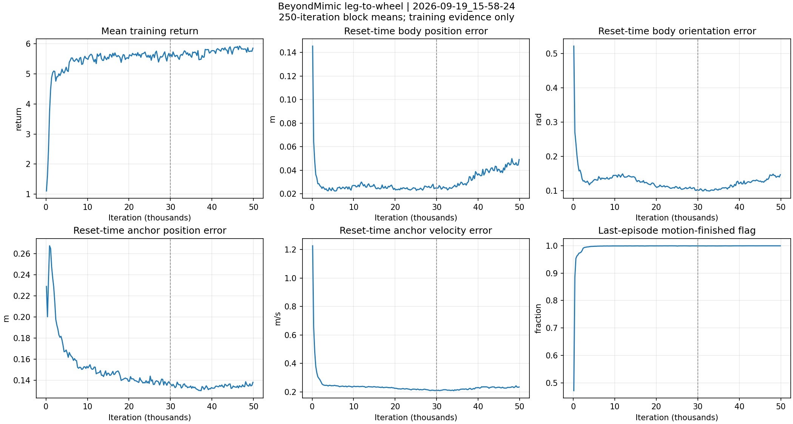

# BeyondMimic leg_to_wheel 训练证据分析

结论：本次 PPO 训练按预算完成，训练随机化分布下的失败终止标记很少；末期奖励变化很小，但部分记录的身体跟踪误差比约 30k 迭代时更大。尚未进行针对该 checkpoint 的闭环轨迹评估，不能确认第 0 帧完整变形成功率，也不能宣称收敛或最终 checkpoint 最优。

## 策略身份与有效配置

- Task：`RobotLab-Isaac-BeyondMimic-Flat-LW-leg-v0`；run：`2026-09-19_15-58-24`；host_id：`younghit`；seed：42。
- 分析对象：`/home/young/liufengrong/robot_lab/logs/rsl_rl/LW_leg_beyongdmimic/2026-09-19_15-58-24/model_49999.pt`；checkpoint iteration：49999；SHA-256：`aa31a4d3af8a8dd27894dffdc3a2edf7b8e7b8056854dae7be990c98d566dccb`。这只是本次分析对象，不构成部署或导出选择。
- 用户确认启动命令 `bash scripts/start_beyondmimic.sh --type leg`，无附加覆盖；实际 Python argv 由已核对的启动脚本展开并写入 context。
- 历史训练 HEAD：`60c12edf07c833ba439e78ba26996d7fc133c39e`，伴有保存的 dirty diff；当前 HEAD：`3e90155c24c56279fe41ae6c751b77987481d422`。记录的五项脚本/训练源码 diff 新 blob 前缀全部匹配当前内容，其余捕获配置与历史基准内容的逐文件比对见 metrics JSON。当前播放脚本有已批准修改，不将当前 HEAD 冒充历史训练 HEAD。
- 以捕获的 `params/env.yaml` / `params/agent.yaml` 为配置依据：4096 环境，50000 iterations，24 steps/env，PPO / OnPolicyRunner；actor/critic/action 维度 59/146/10，单帧，MLP 512/256/128，无 actor/critic 观测归一化。
- physics dt=0.005 s，decimation=4，控制频率 50 Hz。动作文件名含 60hz，但 NPZ 实际 fps=50，共 139 帧，首末帧间隔 2.76 s；当前控制频率与数据 fps 一致。
- 有效随机化包括机身质量 add(-1,3) kg、其他连杆质量 scale(0.8,1.2) 且重算惯量、COM 三轴 ±0.075 m、PD scale(0.8,1.2)、材质、默认关节偏移、初始状态扰动和间隔推力；执行器延迟范围为 0–3 个物理步。
- 日志终点 49999/50000，total timesteps=4,915,200,000，训练输出 `Training time: 34313.63 seconds`（约 9.53 h）。health helper 输出 completed。
- 检查 39 个按迭代记录的 TensorBoard 标量标签，无 NaN/Inf；checkpoint model_state_dict 全部有限。当前无训练或播放进程，未执行 GPU 仿真。

## 训练趋势

以下为表头范围内 TensorBoard 标量的算术平均，范围包含两端，各 1000 次迭代。统计窗口仅用于观察，并非用户批准的收敛阈值。

| 指标 | 29000–29999 | 48000–48999 | 49000–49999 |
|---|---:|---:|---:|
| 训练回报 | 5.57350 | 5.79174 | 5.78124 |
| 相对身体位置误差（cm） | 2.55324 | 4.64811 | 4.60291 |
| 相对身体姿态误差（rad） | 0.10350 | 0.14399 | 0.14248 |
| 全局 anchor 位置误差（cm） | 13.72685 | 13.61457 | 13.62931 |
| 全局 anchor 姿态误差（rad） | 0.09162 | 0.08456 | 0.08614 |
| anchor 线速度误差（m/s） | 0.21006 | 0.23341 | 0.23530 |
| anchor 角速度误差（rad/s） | 0.72491 | 0.72704 | 0.71609 |
| motion_finished 日志比例（%） | 99.93512 | 99.96522 | 99.96113 |
| 平均 episode 长度（控制步） | 64.79365 | 66.87374 | 66.80301 |

- 最近两个 1000-iteration 窗口回报约 5.7917→5.7812（-0.18%），变化很小；不能据此自动续训或宣布收敛。
- 29000–29999 与 49000–49999 比较：相对身体位置误差 2.55→4.60 cm（约 +80.3%），姿态误差 0.1035→0.1425 rad（约 +37.7%），anchor 线速度误差 0.2101→0.2353 m/s。末期回报相较前者约提高 3.7%，说明回报与这里记录的跟踪误差并不同步。30k 与 49999 值得在相同条件下复测，但训练窗口不能直接归因到某一个 checkpoint 的闭环表现。
- 最近 1000 次迭代失败终止标记均值：anchor_pos=0.00006305，anchor_ori=0.00000131，ee_body_pos=0.00032805。它们可能重叠，不应直接相加当作失败概率。

## 必须保留的统计口径

1. `MotionCommand._adaptive_sampling` 从随机参考帧开始。末期平均 episode 约 66.80 步（1.34 s），而整段参考 2.76 s；短 episode 与随机起点一致，不能直接视为提前失败。`motion_finished` 约 99.961% 是训练终止日志标记均值，不能当作从第 0 帧完整执行的成功率。
2. `MotionCommand._update_metrics` 覆盖当前误差，`CommandTerm.reset` 汇总重置环境的已有 metric；这些误差偏重重置附近，且 manager 的更新先后存在一步时序，绝非每条完整轨迹 RMSE。身体位置指标是经过 anchor 平移/航向对齐后的相对误差，anchor 指标则是全局误差。
3. `TerminationManager.reset` 汇总每个环境最近一次 episode 的终止标记，日志再按训练迭代聚合；不是严格独立、逐 episode 加权的事件成功率。
4. `error_joint_pos` 最近均值约 3.1234，是包含轮关节角度的全关节 L2 范数；不能读成腿关节平均偏差 3.12 rad。下一步应分开报告八个位置关节与两个轮关节的速度误差。
5. Episode_Reward 各项为累计奖励除以配置 max_episode_length_s=10 s；不能把单项数值当作瞬时跟踪得分。低 torque/contact 惩罚也不能证明峰值扭矩或触地切换满足要求。

## 闭环评估缺口与具体后续方案

现有 `evaluate_policy.py` 在采集 command 时固定读取 `base_velocity`；BeyondMimic 使用 `motion`（关节位置/速度向量）。直接套用会缺少必需 command 信号，并缺少参考帧、逐帧身体误差、完整片段成功率及足/轮接触切换证据。现有播放脚本也没有完整、可验证的这些遥测，且带自动导出行为，因此本次没有用它替代评估。

建议先补齐评估端适配，提交具体代码方案后获得批准：
- `scripts/reinforcement_learning/rsl_rl/evaluate_policy.py`：识别 motion 任务，支持第 0 帧起点，保持参考帧与物理步/观测同步；在自动 reset 前采集动作、参考/实际状态、接触、扭矩及终止原因；分开统计 motion_finished 与提前失败，跨 reset 的 action-rate 不作连续轨迹差分。
- `scripts/reinforcement_learning/rsl_rl/policy_evaluation_telemetry.py`：定义 motion 所需信号和单位，分离位置关节/轮关节，记录实际 frame index、foot/wheel 接触力、力矩限幅和跟踪误差，缺失信号保持 unknown。
- `scripts/reinforcement_learning/rsl_rl/policy_evaluation_evidence.py`：校验 motion 场景控制参数、来源/配置/motion 数据哈希及上述信号完整性；补充相关回归测试。沿用现有批量执行、哈希和不可覆写证据协议。

首轮待批准预算：只测 `model_49999.pt`，Native，seed42，无视频，1环境/场景，依次运行三场景各2000控制步（每场景最多180秒墙钟）：A 标称模型、第0帧；B 训练随机化、第0帧；C 训练随机化、原始随机起点。A 关闭 event 随机化、观测噪声、初始姿态/速度/关节扰动并将执行器延迟固定为0；B/C 使用有效训练配置，B 仅固定起始帧。合计6000步、120 s仿真时间，失败记录保留，不自动重试。1环境的 startup 材质/质量样本有限，不据此宣称覆盖整个随机化范围。暂不做 checkpoint 自动选择、导出、部署或参数调整。

这三场景是描述性诊断，不设自造验收门槛；如需正式收敛判断，需另行确认绑定本 run 的量化标准。未来 30k/49999 比较需要完全匹配的场景、时长、seed、环境数和判据。

正式 assessment：`insufficient_evidence`；convergence：`indeterminate`；`direct_parameter_change_supported=false`。当前证据支持“训练已完成且值得开展完整轨迹验证”，不支持“策略已收敛”“最终 checkpoint 最优”或“可以直接上机”。

仅可进入受监督实物测试；未经实物验证，不代表 hardware-ready。

## 证据

- [完整训练统计、输入哈希、checkpoint/source 核验](metrics-training-review-20260921-001.json)
- [训练日志最后 10000 次迭代](summary-training-review-20260921-001.json)
- [正式 assessment](assessment-training-review-20260921-001.json)
- [health](../health/health-training-review-20260921-001.json)
- [已捕获有效配置](../../provenance/config-7d4e603b42fa6e9aa9d1ffc8a61b4311bbbc55bf67dec4de3e0563efb562e20c.json)
- [当前源码和已确认启动命令 context](../../provenance/context-e76f4ecba9b16797a2d0f69bdf9d7cfa9977f89f4f5dca3a13f577cb7e6b9729.json)
- 原始训练日志：`/home/young/liufengrong/robot_lab/wandb/run-20260919_155840-a53o6y0w/files/output.log`；原始 TensorBoard 与模型：`/home/young/liufengrong/robot_lab/logs/rsl_rl/LW_leg_beyongdmimic/2026-09-19_15-58-24`。
