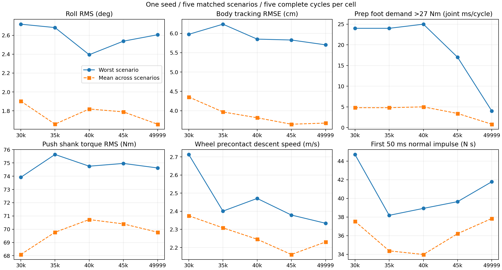

# 10帧策略 checkpoint 比较：30000–49999轮

针对训练 `2026-10-08_21-48-24`，本轮工程首选为 **model_49999.pt**：以减少准备阶段足关节27 Nm硬限幅需求、改善当前随机化下的roll为优先，同时兼顾蹬地小腿力矩RMS。**45000轮保留为落地和腾空时序优先的对照候选**。这不是唯一数学最优，也不是全面最优；五个checkpoint在逐场景多指标比较中均未被另一个完全支配。没有使用未批准的加权总分、收敛门槛或硬件合格判据。

49999轮在当前随机化场景中，准备足关节请求峰值为27.872 Nm，超27 Nm需求为4 joint-ms/完整周期；45000轮对应30.014 Nm、17 joint-ms/周期。49999轮当前随机化roll RMS为2.042°，45000轮为2.297°。蹬地小腿RMS略低（73.211对73.753 Nm），但该场景小腿峰值反而略高（108.334对105.242 Nm）；不能把RMS改善说成所有负载都改善。

代价也明确：49999轮当前随机化下的入地前轮轴下降速度最大值为2.334 m/s，45000轮为2.209 m/s；首次轮接触起50 ms的双轮法向冲量均值分别为37.517、35.182 N·s。五场景平均腾空时间分别为245.8、254.6 ms，均短于参考300 ms。因此若落地代理指标与腾空贴合度是第一优先，应先选45000轮，而不是把49999轮视为这些指标的最优。

以下“均值”是五个场景指标的算术平均；“最差”是五场景最大值，不同列不一定来自同一场景或周期。主统计只纳入每场5个从参考第0帧至第169帧完整成功结束的周期。共125个完整成功周期、0个策略失败周期；25个截断尾段保留而未混入主统计。

| 轮次 | 完整周期 | 准备足超限需求最差 joint-ms/周期 | 蹬地小腿RMS均值 Nm | roll RMS均值 ° | roll绝对峰值最差 ° | 身体位置RMSE均值 cm |
| --- | ---: | ---: | ---: | ---: | ---: | ---: |
| 30000 | 25 | 24.0 | 68.092 | 1.903 | 13.716 | 4.355 |
| 35000 | 25 | 24.0 | 69.769 | 1.659 | 14.445 | 3.968 |
| 40000 | 25 | 25.0 | 70.728 | 1.820 | 13.828 | 3.818 |
| 45000 | 25 | 17.0 | 70.399 | 1.789 | 12.629 | 3.651 |
| 49999 | 25 | 4.0 | 69.775 | 1.658 | 13.338 | 3.680 |

| 轮次 | 入地前轮轴下降速度：场景最大值的均值/最差 m/s | 首次接触50ms法向冲量：场景均值的均值/最差 N·s | 5ms双轮Fz采样峰最差 kN（辅助） | 腾空时间五场景均值 ms |
| --- | ---: | ---: | ---: | ---: |
| 30000 | 2.375/2.714 | 37.537/44.711 | 2.932 | 254.6 |
| 35000 | 2.309/2.401 | 34.370/38.181 | 2.675 | 245.6 |
| 40000 | 2.246/2.471 | 33.977/38.925 | 3.903 | 250.6 |
| 45000 | 2.161/2.379 | 36.213/39.648 | 2.671 | 254.6 |
| 49999 | 2.231/2.334 | 37.842/41.785 | 4.533 | 245.8 |

所有候选在旧随机化场景的蹬地小腿峰值都达到120 Nm硬上限；选择checkpoint尚未解决这项负载问题。30000轮的蹬地小腿平均RMS最低、腾空均值与45000轮并列最长，但当前随机化roll和入地前下降速度较大，准备足超限需求也更多。35000轮标称roll较好，但旧随机化roll峰值14.445°；其五场景roll RMS均值与49999轮几乎持平，不能凭这点微小差异单独定优。40000轮的最差场景roll RMS较小，但准备足超限需求最多。45000轮平均跟踪误差和平均入地前速度较低，49999轮则更适合足超限与当前随机化姿态优先的选择。

执行范围为原训练的30000、35000、40000、45000和实际最后checkpoint 49999轮；没有model_50000.pt。30000轮已完成的play等效场景复用；其零延迟第一次因训练吞吐保护中断，以新批次/attempt ID重试一次。实际新启动21次，20次完成、1次资源中断；这个中断不是策略失败。49999轮五场景及10/6、10/7历史批次均未重跑、未覆盖。

每场Native、1环境、seed42、1000控制步、20 s模拟时间、4000个5 ms物理子步、完整0–169帧遥测、无视频，单场超时600 s。控制周期20 ms，actor输入590=59×10、PPO/OnPolicyRunner。匹配已保存env.yaml/agent.yaml和10/8参考SHA-256 `8f5dec53148b5229b28055b8af968d18dc757e873f1a04bd423b0e8bfc6b2a6b`；25个result bundle及6个批次manifest校验通过，所需31项控制信号完整。

源码已批准的五个奖励时间保持1.65 s；本轮评估原训练checkpoint时显式覆盖回原训练1.6 s，未回退源码改动。轮接触奖励在50 Hz下1.65 s取ceil门限，对应第83帧1.66 s。其他刚体质量随机化仍排除base_link，保留10个其他连杆列表。今天的新训练 `2026-10-09_12-49-52` 独立运行，本比较不评价它，也不能据此判断1.65 s时间适配的训练效果。

play等效、零延迟、固定15 ms均关闭相关域随机化和观测噪声，后两者分别将各执行器delay强制为0及3个5 ms子步；play等效保留原执行器延迟范围。legacy/current两组保留各自的随机化方案且无push；两者同时涉及其他连杆质量、执行器增益等差异及随机数消费，属于整体方案比较，不可归因于单项随机化或某个奖励。不同checkpoint也不是单一奖励项的因果实验。

腾空短的时间分解：49999轮play等效平均全四接触清空发生于1.330 s，结束于1.581 s；相对参考1.300–1.600 s，是离地晚30 ms和接触早19 ms，共少49 ms。当前随机化分别为1.332和1.575 s，共少57 ms。45000轮play等效为1.328–1.586 s，当前随机化为1.328–1.578 s。这里按Fz<10 N连续区间定义腾空，是对接触时序的描述，不能由此认定延迟或奖励门限是单一原因；参考计划窗口与传感器阈值口径也不能完全等同。

准备阶段沿用参考时段[0,1.1)s；蹬地[1.1,1.3)s；计划腾空[1.3,1.6)s；落地缓冲[1.6,2.1)s。超限需求是computed torque超过27 Nm的5 ms足关节采样累计，再除以完整周期数；它不是所有速度相关限幅事件的总时长。小腿负载是执行器施加的关节驱动力矩，不是被动撞击或结构应力。

落地速度取每个轮子在[1.3,2.1)s首次Fz>10 N物理步之前的轮中心世界Z速度，统计向下分量；它不是整机COM速度，未用它乘质量推导真实冲击力。法向冲量取首次任一轮接触的采样bin及其后9个连续5 ms bin，两轮正Fz之和乘dt；包含支撑力，不含摩擦，也不是完整落地过程的总冲量。两轮接触不同步会影响这个固定短窗口，必须结合接触时序CSV阅读。

接触Fz是PhysX/接触传感器每个刚完成5 ms物理步内的平均法向力。双轮求和采样峰不能当作真实瞬时峰、单轮结构峰或实物标定值。49999轮play等效双轮首次接触差为0–5 ms，45000轮为5–20 ms；更同步的接触可能使求和采样峰更尖，这是时序提示，尚非单因素因果证明。力峰仅作为辅助指标，不单独驱动轮次推荐。

新20场显式与用户今天的训练并行，历史49999场景在空闲GPU下完成。固定物理/控制dt与模拟步数匹配，wall FPS和real-time factor不参与策略排名；运行资源模式仍作为可复现性差异保留。接受吞吐下降后，仅取消吞吐阈值中止，保留显存、原训练PID身份、训练进度和超时检查。继续执行期间监督采样FPS中位数约47,587（约原116,181的41%）；最小已采样空闲显存8564 MiB。只停止过资源中断的自有评估，不发送信号给用户训练。

最终实时观察 `2026-10-09T13:56:36.100481+08:00`：训练PID598622及start ticks未变，TensorBoard已到3793轮；最近10条FPS中位数114804、最近64条115178。GPU仅训练占用，已无本轮评估进程。503个受保护文件SHA-256不变，HEAD保持0eb1b8824075b2a43b0aea4f7afe9ae3810487d2；此前批准的6个源文件修改保留、未提交推送。资源模式相关26项单元检查已通过，执行后git diff --check通过。此观察是注明时间的快照。

恢复预检002中`training_baseline.latest_scalar_step=1490`是继承的历史字段；恢复时新采样字段`training_baseline.step=2600`及逐场监督的training.step才是对应实时记录。该继承字段未参与驱动器的进度判断，最终状态JSON已附追加更正说明，未改写预检证据。

只有一个seed、每场五个相关重复周期，未提供批准的收敛或硬件接受判据。本报告给出有限场景下的工程推荐，不作训练收敛或通用鲁棒性判断，也未自动创建策略选择/导出/归档收据。仅可进入受监督实物测试；未经实物验证，不代表 hardware-ready。

证据与复核入口：

- [运行索引](../../index.md)、[原49999轮五场景报告](../../evaluations/history10-newref-20261009-001/report.md)。
- [逐场景指标](checkpoint-comparison-metrics-20261009-002.csv)、[分阶段指标](checkpoint-comparison-phase-metrics-20261009-002.csv)、[逐关节指标](checkpoint-comparison-joint-metrics-20261009-002.csv)。
- [完整/截断周期分类](checkpoint-comparison-cycle-classification-20261009-002.csv)、[接触时序](checkpoint-comparison-contact-timing-20261009-002.csv)、[落地事件](checkpoint-comparison-landing-events-20261009-002.csv)。
- [分析校验链](checkpoint-comparison-analysis-audit-20261009-002.json)、[计算代码](checkpoint-analysis-driver-20261009-002.json)、[机器指标及Pareto关系](checkpoint-comparison-metrics-20261009-002.json)。
- [批准的恢复计划](checkpoint-comparison-plan-20261009-002.json)、[第一次中断证据](checkpoint-comparison-impact-20261009-001.json)、[继续执行影响](checkpoint-comparison-impact-20261009-002.json)、[最终实时状态](checkpoint-comparison-final-state-20261009-002.json)。
