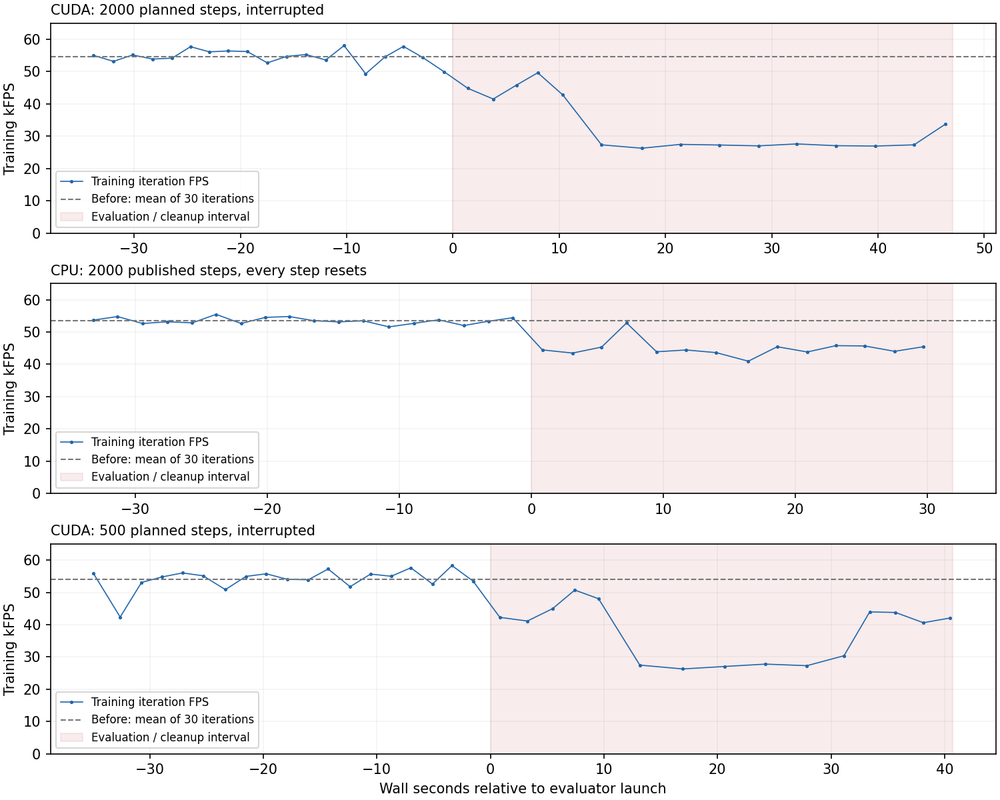

# model_21000 训练重叠评估：有效闭环结果尚未取得

本次没有获得可用于判定速度跟踪、停车净漂移和双髋振荡的有效连续闭环窗口。两次 CUDA 评估使训练吞吐约减半，按规则只停止评估；CPU 评估发布了完整 2000 步遥测，但每一步都因 illegal_contact 复位。不能把复位后的零速度、零倾角或零位移当作稳定表现。

报告时间：2026-10-03T00:25:53.923815+08:00。训练任务：RobotLab-Isaac-Velocity-Flat-LW-wheel-Roa-v0；run：2026-10-02_14-30-02。使用 isaacsim-5.1。

## 固定的策略与有效配置

- 绑定时最新完整 checkpoint：model_21000.pt，内部 iter=21001，4,928,527 bytes；CPU load 成功，读取前后 size/mtime 一致。SHA-256：330ac2360e010eb4622bfd3d29f65753a14f78a266b1509d641f879e047579c8。后续测试没有追随训练更新切换模型。
- 当前 branch=main，HEAD=2fac895a78cea615503ee759888072eb7fe23a0c。该 HEAD 不单独证明训练最初启动 HEAD。相关脏源码与训练捕获 diff 的内容相符；所有原有脏文件及旧证据保留。
- OnPolicyRunnerROA / ROAPPO，seed=42，训练 4096 envs，physics dt=0.005 s、decimation=4（50 Hz），10×39 history，use_velocity_estimation=true，estimated_velocity_schedule=[1,1,0,1]。Native 默认 inference 使用 student/history 分支。
- 有效 YAML：腿部 delay 0–30 ms，wheel/foot delay 0–15 ms；腿部 Kp=90、Kd=3；reset 时 gain scale 均匀 [0.8,1.2]；joint velocity noise [-1.5,1.5] rad/s、scale=0.05。
- action_rate_legs_l2=-0.5，action_smoothness_legs=-0.15，penalize_hip_roll_action=null，feet_distance_penalize=-100、区间 [0.496,0.536] m，stop_motion=-5。
- 原始 env.yaml SHA-256：55fabdd81fa596011fb44dfc786270424e874a64fb1858ea6ffe769bd0923ffa；agent.yaml：2cbc63544d8513907ad615d9dc9d640553e9b8d084e06863624f9c993eb6cd86。

[训练来源](<../../provenance/context-8725ba0fd4fea12981095536d2e69ab4eff6607ab008d1517b807ab9d6400065.json>) · [完整有效 YAML](<../../provenance/config-dfa33f8c8d272c7a177f09ebd1cf9167d2a9413f6b398785dba55e8953adec94.json>) · [评估器源码快照](<../../provenance/source-727f2fdab9dc49dc6ed2ae64bb350f61f4ab9907e83a744bdc300a9242306029.json>) · [只读核实与授权边界记录](<../../evidence/training/preflight-model21000-20261003-001.json>)。

## 有界尝试与训练影响

每个尝试均 Native、1 env、seed42、无视频、stride1；没有测试旧策略。2000 步是每次尝试的上限，并未执行长期或多 checkpoint 批次。仅 CPU 的 2000 步有已发布逐步数据，两次 CUDA 在中止前实际完成多少步无法由现存证据确定。

| 尝试 | 预算 / 执行设备 | 训练 step 前→后 | 评估前 FPS（30轮均值） | 重叠 FPS（5轮均值） | 结果 |
| --- | --- | --- | --- | --- | --- |
| native-quick-a01 | 2000 / CUDA | 21275→21290 | 54532 | 27082–27203 | 吞吐下降约50%，只停止评估；没有 result.json |
| native-quick-cpu-a02 | 2000 / CPU | 21403→21417 | 53555 | 44946–46011 | 发布完成、文件校验 valid；2000/2000 illegal_contact 和 done |
| native-quick-gpu500-a03 | 500 / CUDA | 21563→21578 | 54009 | 27188（后一个监控点） | 缩短预算后仍下降约50%，只停止评估；没有 result.json |

CPU 尝试约31.94 s墙钟时间，发布40 s仿真数据，训练吞吐在所读重叠窗口低约14–16%。这不是零干扰；该尝试未触发记录的25%运营停止线。GPU 两次按监控规则终止，训练 PID574265从未被发送信号。

第一轮 CUDA/CPU 指令：0–5 s零，5–15 s vx=0.5，15–30 s vx=0.5/yaw=-0.6，30–40 s零。500步 CUDA 指令：0–1 s零，1–3.5 s直行，3.5–6.5 s右转，6.5–10 s零。所有 y 指令为0。

评估运行时覆盖：plane、固定初始pose/joint reset、episode_length_s=60防止时间复位；各执行器固定15 ms；保留当前观测噪声；关掉push、mass/COM/gain/default-position随机化，摩擦固定1、恢复系数0；关闭地形越界与地形课程。完整覆盖项和指令以各 contract/scenario 为准。这些只影响评估进程，训练 YAML 和源码均未修改。CPU 另声明 sim.device=cpu 与 agent.device=cpu。500步 Native 用默认 student inference，未请求额外 teacher/student 对照诊断；前两次执行student并记录对照输出。

图中阴影覆盖评估和其退出处理窗口；折线来自本轮同一训练 PID 的 TensorBoard Perf/total_fps逐轮值。监控停止线仅用于控制资源干扰，不是策略性能或收敛判据。

## CPU 结果的有效性分析

文件绑定、checkpoint/source/scenario/config哈希与遥测重复绑定通过校验；telemetry_status=complete、missing_required_signals=[]，2000个样本，各所需反馈信号的采样状态均完整。

同时，2000个样本均 done=true、timeout=false，illegal_contact_count=2000。最长连续非done片段=0，root位置和joint位置各仅一个唯一值；这些是env.step自动复位后的状态。由此：

| 关注项 | 当前可下的结论 |
| --- | --- |
| 速度跟踪 | 无有效固定checkpoint闭环指标；CPU raw tracking RMSE反映复位状态，不能据此评分 |
| 停车漂移 | 无连续停车窗口；零净位移不可用 |
| 双髋振荡 | 无连续反馈窗口，不能计算或解释5–25 Hz频谱、幅值或衰减 |
| 倾角和关节限幅 | CPU raw零速度/零倾角不能证明稳定；复位前接触和关节状态未被记录 |
| CPU接触异常原因 | 需要另行核实；当前证据不足以归因于策略或单项训练改动 |

CPU console含“Collisions are supported currently only in one collision group”警告。base_illegal_contact从net contact history减去filtered self-contact history；本包没有这两个接触力张量，警告仅是接触过滤排查线索。没有关闭illegal_contact来强行取得曲线，也没有以CPU异常推断GPU策略一定失稳。

原始CPU result中的加速度派生指标报告“insufficient consecutive samples after transition exclusions”；缺失值保持不可用。原始结果没有重写，语义有效性排除记录在 [机器分析与校验记录](<../../evidence/analysis/live-overlap-model21000-20261003-001/metrics.json>)。

## 当前训练统计，独立于 model_21000 测试

恢复快照：2026-10-03T00:18:00.587428+08:00，同一PID/argv/start ticks，TensorBoard step=21683；最近5轮FPS=55405，最近100轮均值=54447。进度从最初21173到21683单调推进，所读loss有限。这证明这些观测窗口有进展，不能证明全部训练稳定或已经收敛。

最近100条训练scalar均值：reward=134.7584；episode length=995.631/1000；error_vel_xy=0.4546；error_vel_yaw=0.5552。后两项是训练命令的累计范数/绝对误差统计，不是Native固定场景RMSE。

零指令student日志点（8个，step 21540–21680）中，近静止比例的算术平均=1.734%。near_stationary定义为真实平移速度范数≤0.02 m/s且真实yaw rate绝对值≤0.05 rad/s；这是训练诊断的既有定义，不是新批准的验收门槛。该现象支持后续把停车列为重点问题，但训练包含动作探索噪声、随机化和持续更新的权重，不能作为model_21000确定性停车净漂移测量。奖励action-rate/smoothness/hip项也不能替代双髋时序频谱。

## 下一有界动作与限制

应在GPU自然空闲后，用已有Native CUDA单环境/no-video/≤2000步路线补完原40秒问题。当前不再继续启动会影响训练的CUDA尝试。CPU若再使用，先解决接触过滤/终止有效性并保留保护条件；涉及代码的修改先列文件和方案，再等待用户明确批准。

没有本run用户批准的convergence criteria：assessment=insufficient_evidence，convergence=indeterminate，direct_parameter_change_supported=false。未改代码或训练参数，未启停/恢复训练，未安装或删除用户文件，未做实机复现、导出、提交或推送。旧策略测量仅作为路径/既有场景参考，不是本轮新测。

仅可进入受监督实物测试；未经实物验证，不代表 hardware-ready。此句不是部署或实机测试授权。

## 证据入口

- [CUDA2000 contract](<../overlap-native-model21000-20261003-001/contract.json>) · [CUDA2000 console](<../overlap-native-model21000-20261003-001/raw/native-quick-a01/console.log>)
- [CPU2000 contract](<../overlap-native-cpu-model21000-20261003-002/contract.json>) · [CPU result](<../overlap-native-cpu-model21000-20261003-002/raw/native-quick-cpu-a02/result.json>) · [CPU完整telemetry](<../overlap-native-cpu-model21000-20261003-002/raw/native-quick-cpu-a02/telemetry.json.gz>) · [CPU console](<../overlap-native-cpu-model21000-20261003-002/raw/native-quick-cpu-a02/console.log>)
- [CUDA500 contract](<contract.json>) · [CUDA500 console](<raw/native-quick-gpu500-a03/console.log>)
- [机器分析（含分析源码与reset有效性）](<../../evidence/analysis/live-overlap-model21000-20261003-001/metrics.json>) · [恢复后训练快照](<../../evidence/training/overlap-short-model21000-20261003-003-recovery.json>)
