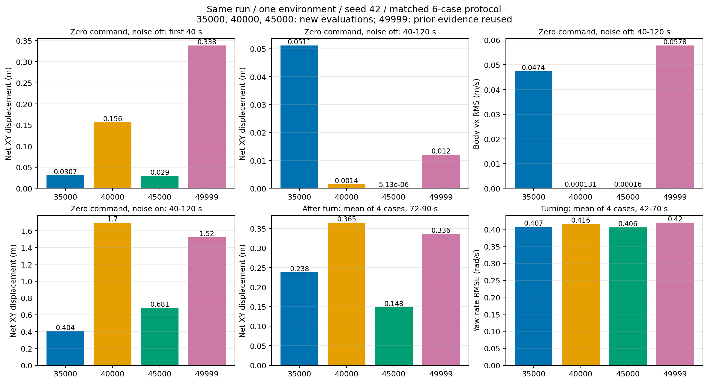
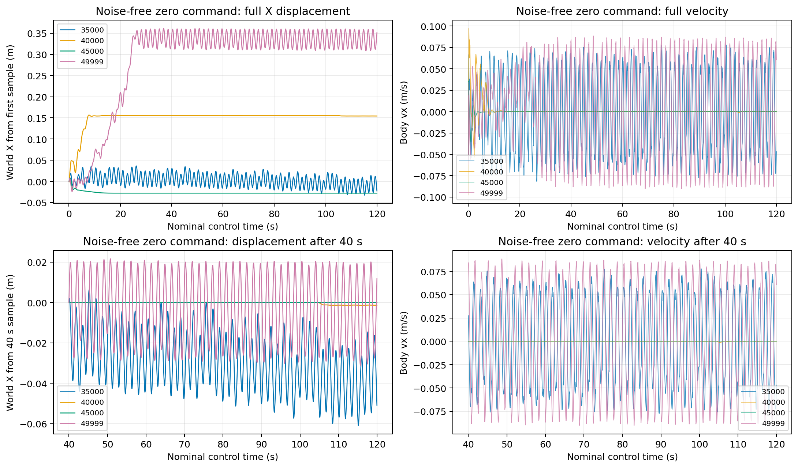
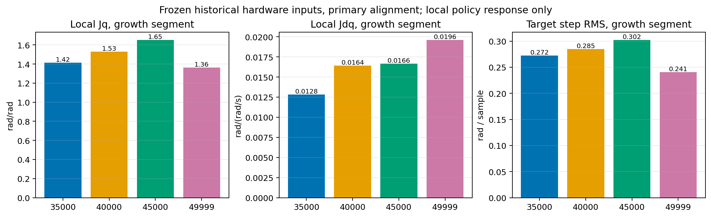

# 评估批次 wheel-flat-late-model45000-20261003-001

任务：`RobotLab-Isaac-Velocity-Flat-LW-wheel-Roa-v0`；训练：`2026-10-02_14-30-02`。

本报告汇总已校验的用例；completed 表示证据发布完成，策略表现须结合指标和视频判断。

| 用例 / 尝试 | 状态 | 场景、步数 / 环境 / seed | 遥测 | 结果与视频 |
| --- | --- | --- | --- | --- |
| right-delay15-noise-a01 | completed | right-delay15-noise，4500 / 1 / 42 | complete | [结果](<raw/right-delay15-noise-a01/result.json>) / [日志](<raw/right-delay15-noise-a01/console.log>) |
| left-delay15-noise-a01 | completed | left-delay15-noise，4500 / 1 / 42 | complete | [结果](<raw/left-delay15-noise-a01/result.json>) / [日志](<raw/left-delay15-noise-a01/console.log>) |
| right-delay30-noise-a01 | completed | right-delay30-noise，4500 / 1 / 42 | complete | [结果](<raw/right-delay30-noise-a01/result.json>) / [日志](<raw/right-delay30-noise-a01/console.log>) |
| left-delay30-noise-a01 | completed | left-delay30-noise，4500 / 1 / 42 | complete | [结果](<raw/left-delay30-noise-a01/result.json>) / [日志](<raw/left-delay30-noise-a01/console.log>) |
| nominal-no-noise-a01 | completed | nominal-no-noise，6000 / 1 / 42 | complete | [结果](<raw/nominal-no-noise-a01/result.json>) / [日志](<raw/nominal-no-noise-a01/console.log>) |
| nominal-training-noise-a01 | completed | nominal-training-noise，6000 / 1 / 42 | complete | [结果](<raw/nominal-training-noise-a01/result.json>) / [日志](<raw/nominal-training-noise-a01/console.log>) |

## 策略与场景

- checkpoint SHA-256：`a6b097b83272657e9f1068cafc5c74ecb5e23e6d9e8ca06f9d472bc2fe36c85b`；runner：`OnPolicyRunnerROA`。
- [场景来源 scenario-345ff007c165cacf4a2984801581dea2de58af1f0569f2cd1a9c8e93bf4e8e06.json](<../../provenance/scenario-345ff007c165cacf4a2984801581dea2de58af1f0569f2cd1a9c8e93bf4e8e06.json>)
- [场景来源 scenario-4e3890ad874e661b8d244215714430e0fc8f25a3a24caf46117abbc8084c0b61.json](<../../provenance/scenario-4e3890ad874e661b8d244215714430e0fc8f25a3a24caf46117abbc8084c0b61.json>)
- [场景来源 scenario-5d0a6b5b60dbd6c30207ffd777d098aa790a24b8e5fbde18e303a93b91378292.json](<../../provenance/scenario-5d0a6b5b60dbd6c30207ffd777d098aa790a24b8e5fbde18e303a93b91378292.json>)
- [场景来源 scenario-5e3299d8ec5d142110c815fa1c5ce768cde9d5beffdf222f9bb542dc61aa7c82.json](<../../provenance/scenario-5e3299d8ec5d142110c815fa1c5ce768cde9d5beffdf222f9bb542dc61aa7c82.json>)
- [场景来源 scenario-a6bbef86a19a97729db508d7ff959c7d5a06eeaae825971a980a9e53e2cba5b7.json](<../../provenance/scenario-a6bbef86a19a97729db508d7ff959c7d5a06eeaae825971a980a9e53e2cba5b7.json>)
- [场景来源 scenario-fbc1c4d2de7fbcffa1bd070e3661805154ba6cca8c8bd5e8b8b39e47ae258b50.json](<../../provenance/scenario-fbc1c4d2de7fbcffa1bd070e3661805154ba6cca8c8bd5e8b8b39e47ae258b50.json>)
- [训练上下文 context-8725ba0fd4fea12981095536d2e69ab4eff6607ab008d1517b807ab9d6400065.json](<../../provenance/context-8725ba0fd4fea12981095536d2e69ab4eff6607ab008d1517b807ab9d6400065.json>)
- [训练有效配置 config-dfa33f8c8d272c7a177f09ebd1cf9167d2a9413f6b398785dba55e8953adec94.json](<../../provenance/config-dfa33f8c8d272c7a177f09ebd1cf9167d2a9413f6b398785dba55e8953adec94.json>)

- `right-delay15-noise-a01` 指标：`{"max_joint_velocity_utilization": 0.3373619318008423, "max_tilt": 0.14784619212150574, "termination_rate": 0.0, "tracking_xy_rmse": 0.07600808892060677, "tracking_yaw_rmse": 0.2406751903187171}`
- `right-delay15-noise-a01` 命令调度：`[{"command": [0, 0, 0], "end_step": 499, "start_step": 0}, {"command": [0.5, 0, 0], "end_step": 1999, "start_step": 500}, {"command": [0.5, 0, -0.6], "end_step": 3499, "start_step": 2000}, {"command": [0, 0, 0], "end_step": 4499, "start_step": 3500}]`；训练配置覆盖：`{"curriculum.terrain_levels": null, "episode_length_s": 120.0, "evaluation.roa_mode": "student", "events.add_joint_default_pos": null, "events.randomize_actuator_gains": null, "events.randomize_com_positions": null, "events.randomize_push_robot": null, "events.randomize_reset_base.params.pose_range": {"pitch": [0.0, 0.0], "roll": [0.0, 0.0], "x": [0.0, 0.0], "y": [0.0, 0.0], "yaw": [0.0, 0.0], "z": [0.0, 0.0]}, "events.randomize_reset_base.params.velocity_range": {"pitch": [0.0, 0.0], "roll": [0.0, 0.0], "x": [0.0, 0.0], "y": [0.0, 0.0], "yaw": [0.0, 0.0], "z": [0.0, 0.0]}, "events.randomize_reset_joints.params.position_range": [0.0, 0.0], "events.randomize_reset_joints.params.velocity_range": [0.0, 0.0], "events.randomize_rigid_body_mass_base": null, "events.randomize_rigid_body_mass_others": null, "events.randomize_rigid_body_material.params.dynamic_friction_range": [1.0, 1.0], "events.randomize_rigid_body_material.params.restitution_range": [0.0, 0.0], "events.randomize_rigid_body_material.params.static_friction_range": [1.0, 1.0], "observations.policy.enable_corruption": true, "scene.robot.actuators.foots.max_delay": 3, "scene.robot.actuators.foots.min_delay": 3, "scene.robot.actuators.legs.max_delay": 3, "scene.robot.actuators.legs.min_delay": 3, "scene.robot.actuators.wheels.max_delay": 3, "scene.robot.actuators.wheels.min_delay": 3, "scene.terrain.terrain_generator": null, "scene.terrain.terrain_type": "plane", "terminations.terrain_out_of_bounds": null}`。
- `left-delay15-noise-a01` 指标：`{"max_joint_velocity_utilization": 0.3373619318008423, "max_tilt": 0.14784619212150574, "termination_rate": 0.0, "tracking_xy_rmse": 0.08891636167120524, "tracking_yaw_rmse": 0.2575549468708785}`
- `left-delay15-noise-a01` 命令调度：`[{"command": [0, 0, 0], "end_step": 499, "start_step": 0}, {"command": [0.5, 0, 0], "end_step": 1999, "start_step": 500}, {"command": [0.5, 0, 0.6], "end_step": 3499, "start_step": 2000}, {"command": [0, 0, 0], "end_step": 4499, "start_step": 3500}]`；训练配置覆盖：`{"curriculum.terrain_levels": null, "episode_length_s": 120.0, "evaluation.roa_mode": "student", "events.add_joint_default_pos": null, "events.randomize_actuator_gains": null, "events.randomize_com_positions": null, "events.randomize_push_robot": null, "events.randomize_reset_base.params.pose_range": {"pitch": [0.0, 0.0], "roll": [0.0, 0.0], "x": [0.0, 0.0], "y": [0.0, 0.0], "yaw": [0.0, 0.0], "z": [0.0, 0.0]}, "events.randomize_reset_base.params.velocity_range": {"pitch": [0.0, 0.0], "roll": [0.0, 0.0], "x": [0.0, 0.0], "y": [0.0, 0.0], "yaw": [0.0, 0.0], "z": [0.0, 0.0]}, "events.randomize_reset_joints.params.position_range": [0.0, 0.0], "events.randomize_reset_joints.params.velocity_range": [0.0, 0.0], "events.randomize_rigid_body_mass_base": null, "events.randomize_rigid_body_mass_others": null, "events.randomize_rigid_body_material.params.dynamic_friction_range": [1.0, 1.0], "events.randomize_rigid_body_material.params.restitution_range": [0.0, 0.0], "events.randomize_rigid_body_material.params.static_friction_range": [1.0, 1.0], "observations.policy.enable_corruption": true, "scene.robot.actuators.foots.max_delay": 3, "scene.robot.actuators.foots.min_delay": 3, "scene.robot.actuators.legs.max_delay": 3, "scene.robot.actuators.legs.min_delay": 3, "scene.robot.actuators.wheels.max_delay": 3, "scene.robot.actuators.wheels.min_delay": 3, "scene.terrain.terrain_generator": null, "scene.terrain.terrain_type": "plane", "terminations.terrain_out_of_bounds": null}`。
- `right-delay30-noise-a01` 指标：`{"max_joint_velocity_utilization": 0.46837267875671384, "max_tilt": 0.21109539270401, "termination_rate": 0.0, "tracking_xy_rmse": 0.08259691856006263, "tracking_yaw_rmse": 0.2428182844251642}`
- `right-delay30-noise-a01` 命令调度：`[{"command": [0, 0, 0], "end_step": 499, "start_step": 0}, {"command": [0.5, 0, 0], "end_step": 1999, "start_step": 500}, {"command": [0.5, 0, -0.6], "end_step": 3499, "start_step": 2000}, {"command": [0, 0, 0], "end_step": 4499, "start_step": 3500}]`；训练配置覆盖：`{"curriculum.terrain_levels": null, "episode_length_s": 120.0, "evaluation.roa_mode": "student", "events.add_joint_default_pos": null, "events.randomize_actuator_gains": null, "events.randomize_com_positions": null, "events.randomize_push_robot": null, "events.randomize_reset_base.params.pose_range": {"pitch": [0.0, 0.0], "roll": [0.0, 0.0], "x": [0.0, 0.0], "y": [0.0, 0.0], "yaw": [0.0, 0.0], "z": [0.0, 0.0]}, "events.randomize_reset_base.params.velocity_range": {"pitch": [0.0, 0.0], "roll": [0.0, 0.0], "x": [0.0, 0.0], "y": [0.0, 0.0], "yaw": [0.0, 0.0], "z": [0.0, 0.0]}, "events.randomize_reset_joints.params.position_range": [0.0, 0.0], "events.randomize_reset_joints.params.velocity_range": [0.0, 0.0], "events.randomize_rigid_body_mass_base": null, "events.randomize_rigid_body_mass_others": null, "events.randomize_rigid_body_material.params.dynamic_friction_range": [1.0, 1.0], "events.randomize_rigid_body_material.params.restitution_range": [0.0, 0.0], "events.randomize_rigid_body_material.params.static_friction_range": [1.0, 1.0], "observations.policy.enable_corruption": true, "scene.robot.actuators.foots.max_delay": 6, "scene.robot.actuators.foots.min_delay": 6, "scene.robot.actuators.legs.max_delay": 6, "scene.robot.actuators.legs.min_delay": 6, "scene.robot.actuators.wheels.max_delay": 6, "scene.robot.actuators.wheels.min_delay": 6, "scene.terrain.terrain_generator": null, "scene.terrain.terrain_type": "plane", "terminations.terrain_out_of_bounds": null}`。
- `left-delay30-noise-a01` 指标：`{"max_joint_velocity_utilization": 0.46837267875671384, "max_tilt": 0.21109539270401, "termination_rate": 0.0, "tracking_xy_rmse": 0.09572346056368626, "tracking_yaw_rmse": 0.25763827863631117}`
- `left-delay30-noise-a01` 命令调度：`[{"command": [0, 0, 0], "end_step": 499, "start_step": 0}, {"command": [0.5, 0, 0], "end_step": 1999, "start_step": 500}, {"command": [0.5, 0, 0.6], "end_step": 3499, "start_step": 2000}, {"command": [0, 0, 0], "end_step": 4499, "start_step": 3500}]`；训练配置覆盖：`{"curriculum.terrain_levels": null, "episode_length_s": 120.0, "evaluation.roa_mode": "student", "events.add_joint_default_pos": null, "events.randomize_actuator_gains": null, "events.randomize_com_positions": null, "events.randomize_push_robot": null, "events.randomize_reset_base.params.pose_range": {"pitch": [0.0, 0.0], "roll": [0.0, 0.0], "x": [0.0, 0.0], "y": [0.0, 0.0], "yaw": [0.0, 0.0], "z": [0.0, 0.0]}, "events.randomize_reset_base.params.velocity_range": {"pitch": [0.0, 0.0], "roll": [0.0, 0.0], "x": [0.0, 0.0], "y": [0.0, 0.0], "yaw": [0.0, 0.0], "z": [0.0, 0.0]}, "events.randomize_reset_joints.params.position_range": [0.0, 0.0], "events.randomize_reset_joints.params.velocity_range": [0.0, 0.0], "events.randomize_rigid_body_mass_base": null, "events.randomize_rigid_body_mass_others": null, "events.randomize_rigid_body_material.params.dynamic_friction_range": [1.0, 1.0], "events.randomize_rigid_body_material.params.restitution_range": [0.0, 0.0], "events.randomize_rigid_body_material.params.static_friction_range": [1.0, 1.0], "observations.policy.enable_corruption": true, "scene.robot.actuators.foots.max_delay": 6, "scene.robot.actuators.foots.min_delay": 6, "scene.robot.actuators.legs.max_delay": 6, "scene.robot.actuators.legs.min_delay": 6, "scene.robot.actuators.wheels.max_delay": 6, "scene.robot.actuators.wheels.min_delay": 6, "scene.terrain.terrain_generator": null, "scene.terrain.terrain_type": "plane", "terminations.terrain_out_of_bounds": null}`。
- `nominal-no-noise-a01` 指标：`{"max_joint_velocity_utilization": 0.15052261352539062, "max_tilt": 0.06569468230009079, "termination_rate": 0.0, "tracking_xy_rmse": 0.0021711036459717272, "tracking_yaw_rmse": 0.0031855296754571753}`
- `nominal-no-noise-a01` 命令调度：`[{"command": [0, 0, 0], "end_step": 5999, "start_step": 0}]`；训练配置覆盖：`{"curriculum.terrain_levels": null, "episode_length_s": 150.0, "events.add_joint_default_pos": null, "events.randomize_actuator_gains": null, "events.randomize_com_positions": null, "events.randomize_push_robot": null, "events.randomize_reset_base.params.pose_range": {"pitch": [0.0, 0.0], "roll": [0.0, 0.0], "x": [0.0, 0.0], "y": [0.0, 0.0], "yaw": [0.0, 0.0], "z": [0.0, 0.0]}, "events.randomize_reset_base.params.velocity_range": {"pitch": [0.0, 0.0], "roll": [0.0, 0.0], "x": [0.0, 0.0], "y": [0.0, 0.0], "yaw": [0.0, 0.0], "z": [0.0, 0.0]}, "events.randomize_reset_joints.params.position_range": [0.0, 0.0], "events.randomize_reset_joints.params.velocity_range": [0.0, 0.0], "events.randomize_rigid_body_mass_base": null, "events.randomize_rigid_body_mass_others": null, "events.randomize_rigid_body_material.params.dynamic_friction_range": [1.0, 1.0], "events.randomize_rigid_body_material.params.restitution_range": [0.0, 0.0], "events.randomize_rigid_body_material.params.static_friction_range": [1.0, 1.0], "observations.policy.enable_corruption": false, "scene.robot.actuators.foots.max_delay": 0, "scene.robot.actuators.foots.min_delay": 0, "scene.robot.actuators.legs.max_delay": 0, "scene.robot.actuators.legs.min_delay": 0, "scene.robot.actuators.wheels.max_delay": 0, "scene.robot.actuators.wheels.min_delay": 0, "scene.terrain.terrain_generator": null, "scene.terrain.terrain_type": "plane", "terminations.terrain_out_of_bounds": null}`。
- `nominal-training-noise-a01` 指标：`{"max_joint_velocity_utilization": 0.21982297030362216, "max_tilt": 0.09365464746952057, "termination_rate": 0.0, "tracking_xy_rmse": 0.04233328968285108, "tracking_yaw_rmse": 0.037421700125623125}`
- `nominal-training-noise-a01` 命令调度：`[{"command": [0, 0, 0], "end_step": 5999, "start_step": 0}]`；训练配置覆盖：`{"curriculum.terrain_levels": null, "episode_length_s": 150.0, "events.add_joint_default_pos": null, "events.randomize_actuator_gains": null, "events.randomize_com_positions": null, "events.randomize_push_robot": null, "events.randomize_reset_base.params.pose_range": {"pitch": [0.0, 0.0], "roll": [0.0, 0.0], "x": [0.0, 0.0], "y": [0.0, 0.0], "yaw": [0.0, 0.0], "z": [0.0, 0.0]}, "events.randomize_reset_base.params.velocity_range": {"pitch": [0.0, 0.0], "roll": [0.0, 0.0], "x": [0.0, 0.0], "y": [0.0, 0.0], "yaw": [0.0, 0.0], "z": [0.0, 0.0]}, "events.randomize_reset_joints.params.position_range": [0.0, 0.0], "events.randomize_reset_joints.params.velocity_range": [0.0, 0.0], "events.randomize_rigid_body_mass_base": null, "events.randomize_rigid_body_mass_others": null, "events.randomize_rigid_body_material.params.dynamic_friction_range": [1.0, 1.0], "events.randomize_rigid_body_material.params.restitution_range": [0.0, 0.0], "events.randomize_rigid_body_material.params.static_friction_range": [1.0, 1.0], "observations.policy.enable_corruption": true, "scene.robot.actuators.foots.max_delay": 0, "scene.robot.actuators.foots.min_delay": 0, "scene.robot.actuators.legs.max_delay": 0, "scene.robot.actuators.legs.min_delay": 0, "scene.robot.actuators.wheels.max_delay": 0, "scene.robot.actuators.wheels.min_delay": 0, "scene.terrain.terrain_generator": null, "scene.terrain.terrain_type": "plane", "terminations.terrain_out_of_bounds": null}`。

## 观察与限制

- 18 newly evaluated Native cases across35000/40000/45000; final49999 and historical policy inference reused.
- No approved convergence/acceptance criteria; the comparison is descriptive and does not authorize export.
- 未提供用户批准的收敛判据时，不作收敛判断；缺失遥测不能按零值解释。
- 视频需经机器人持续在画面内的人工检查后才可作为动作证据。

## 相关证据

- [late-checkpoint-comparison-20261003-001-preflight.json](<../../evidence/source/late-checkpoint-comparison-20261003-001-preflight.json>)
- [late-checkpoint-native-controller-20261003-001.json](<../../evidence/source/late-checkpoint-native-controller-20261003-001.json>)
- [late-checkpoint-group-analysis-20261003-001.json](<../../evidence/source/late-checkpoint-group-analysis-20261003-001.json>)
- [metrics.json](<../../evidence/analysis/final-model49999-batch-20261003-001/metrics.json>)
- [manifest.json](<../wheel-flat-final-delay30-20261003-001/manifest.json>)
- [metrics.json](<../../evidence/analysis/static-rightturn-model35000-20261003-001/metrics.json>)
- [samples-and-jacobians.npz](<../../evidence/analysis/static-rightturn-model35000-20261003-001/samples-and-jacobians.npz>)
- [per-frame-comparison.csv](<../../evidence/analysis/static-rightturn-model35000-20261003-001/per-frame-comparison.csv>)
- [comparison.png](<../../evidence/analysis/static-rightturn-model35000-20261003-001/comparison.png>)
- [manifest.json](<../wheel-flat-late-model35000-20261003-001/manifest.json>)
- [metrics.json](<../../evidence/analysis/late-model35000-batch-20261003-001/metrics.json>)
- [metrics.json](<../../evidence/analysis/static-rightturn-model40000-20261003-001/metrics.json>)
- [samples-and-jacobians.npz](<../../evidence/analysis/static-rightturn-model40000-20261003-001/samples-and-jacobians.npz>)
- [per-frame-comparison.csv](<../../evidence/analysis/static-rightturn-model40000-20261003-001/per-frame-comparison.csv>)
- [comparison.png](<../../evidence/analysis/static-rightturn-model40000-20261003-001/comparison.png>)
- [manifest.json](<../wheel-flat-late-model40000-20261003-001/manifest.json>)
- [metrics.json](<../../evidence/analysis/late-model40000-batch-20261003-001/metrics.json>)
- [metrics.json](<../../evidence/analysis/static-rightturn-model45000-20261003-001/metrics.json>)
- [samples-and-jacobians.npz](<../../evidence/analysis/static-rightturn-model45000-20261003-001/samples-and-jacobians.npz>)
- [per-frame-comparison.csv](<../../evidence/analysis/static-rightturn-model45000-20261003-001/per-frame-comparison.csv>)
- [comparison.png](<../../evidence/analysis/static-rightturn-model45000-20261003-001/comparison.png>)
- [metrics.json](<../../evidence/analysis/late-model45000-batch-20261003-001/metrics.json>)
- [metrics.json](<../../evidence/analysis/static-rightturn-model49999-20261003-001/metrics.json>)
- [samples-and-jacobians.npz](<../../evidence/analysis/static-rightturn-model49999-20261003-001/samples-and-jacobians.npz>)
- [per-frame-comparison.csv](<../../evidence/analysis/static-rightturn-model49999-20261003-001/per-frame-comparison.csv>)
- [comparison.png](<../../evidence/analysis/static-rightturn-model49999-20261003-001/comparison.png>)
- [matched-comparison.png](<../../evidence/analysis/late-checkpoint-comparison-20261003-001/matched-comparison.png>)
- [zero-command-motion.png](<../../evidence/analysis/late-checkpoint-comparison-20261003-001/zero-command-motion.png>)
- [static-hip-sensitivity.png](<../../evidence/analysis/late-checkpoint-comparison-20261003-001/static-hip-sensitivity.png>)
- [metrics.json](<../../evidence/analysis/late-checkpoint-comparison-20261003-001/metrics.json>)
- [integrity.json](<../../evidence/analysis/late-checkpoint-comparison-20261003-001/integrity.json>)

## 建议与待授权事项

- 按批次报告检查失败项和动作表现；复测使用新的 batch_id 与 attempt_id。

## 35000／40000／45000 与最终49999的同协议比较

本组按已批准方案执行：35000、40000、45000各6个Native场景，共18个新场景、90000步；每轮另对同批505帧历史实机输入做49490个新输入向量的静态分析。49999的6个Native场景和静态结果全部复用，没有再次运行旧策略。每轮各有一个标准批报告，本节统一汇总三批与既有49999证据。

同一训练run为2026-10-02_14-30-02，三轮checkpoint文件名对应内部下一迭代计数35001／40001／45001；最终49999内部计数50000。训练已按50000轮日程结束，测试期间没有活动训练进程，也没有启停或发送信号。日程完成不等于已证明收敛。

全部场景Native、单环境、seed42、无视频、控制周期20ms；四个带训练观测噪声的转向场景分别为左右转×全执行器固定15／30ms延迟，两个零指令场景为零延迟、关闭／开启训练观测噪声。每个转向场景0–10s零指令、10–40s直行0.5m/s、40–70s保持0.5m/s且yaw±0.6rad/s、70–90s停车。两个站立场景持续120s，全程零指令。除所列覆盖外使用同一有效YAML。30ms全执行器测试超出训练轮／脚执行器0–15ms延迟范围。

下表位移为世界XY端点净位移，速度RMS为机体坐标vx。四场景均值是四个单场景标量的算术平均，不是汇总RMSE，也不构成多seed统计。

| 轮次 | 无噪声0–40s净位移m | 无噪声40–120s净位移m | 无噪声稳态vx RMS m/s | 有噪声40–120s净位移m | 四场停车72–90s均值m | 四场稳态yaw RMSE rad/s | 四场髋速5–25Hz RMS rad/s | done次数 |
| --- | --- | --- | --- | --- | --- | --- | --- | --- |
| 35000 | 0.0307 | 0.0511 | 0.0474 | 0.4042 | 0.2375 | 0.4071 | 0.1525 | 0 |
| 40000 | 0.1563 | 0.0014 | 0.0001 | 1.6976 | 0.3652 | 0.4161 | 0.1643 | 0 |
| 45000 | 0.0290 | 0.0000 | 0.0002 | 0.6809 | 0.1483 | 0.4056 | 0.1418 | 0 |
| 49999 | 0.3382 | 0.0120 | 0.0578 | 1.5225 | 0.3362 | 0.4201 | 0.1606 | 0 |

净位移小不代表站稳：周期性前后运动可能在端点抵消。补充列出同一稳态窗的运动路程、最大偏离和vx频率峰，结合轨迹图判断。

| 轮次 | 无噪声0–120s净位移m | 40–120s XY路程m | 稳态最大偏离m | 稳态vx均值m/s | vx频率峰Hz | roll/pitch角速RMS rad/s |
| --- | --- | --- | --- | --- | --- | --- |
| 35000 | 0.0240 | 3.9763 | 0.0610 | -0.000427 | 0.6000 | 0.0974 |
| 40000 | 0.1549 | 0.0036 | 0.0015 | -0.000045 | 0.0500 | 0.0018 |
| 45000 | 0.0290 | 0.0006 | 0.0000 | 0.000160 | 0.5000 | 0.0055 |
| 49999 | 0.3517 | 4.4423 | 0.0317 | -0.000023 | 0.5625 | 0.0954 |

路程来自50Hz采样位置；频率峰来自去均值矩形窗RFFT、0.05–25Hz，频率分辨率0.0125Hz，仅描述本窗。净位移端点跨度分别为39.98／79.98／119.98s。频带指标不是物理子步或实机频谱。

### 转向跟踪及停车分场景

| 轮次 | 场景 | 转向平均vx m/s | vx RMSE m/s | 平均yaw rad/s | yaw RMSE rad/s | 停车18s净位移m | 停车vx RMS m/s | 髋速5–25Hz RMS rad/s | 髋目标逐步RMS rad |
| --- | --- | --- | --- | --- | --- | --- | --- | --- | --- |
| 35000 | right-delay15-noise | 0.4362 | 0.0838 | -0.2171 | 0.4231 | 0.2588 | 0.0596 | 0.1590 | 0.0080 |
| 35000 | left-delay15-noise | 0.4101 | 0.1064 | 0.2492 | 0.3945 | 0.2682 | 0.0606 | 0.1421 | 0.0082 |
| 35000 | right-delay30-noise | 0.4248 | 0.0981 | -0.2260 | 0.4173 | 0.1158 | 0.0630 | 0.1575 | 0.0081 |
| 35000 | left-delay30-noise | 0.4078 | 0.1091 | 0.2535 | 0.3935 | 0.3073 | 0.0565 | 0.1515 | 0.0082 |
| 40000 | right-delay15-noise | 0.4653 | 0.0707 | -0.2005 | 0.4415 | 0.4317 | 0.0587 | 0.1654 | 0.0074 |
| 40000 | left-delay15-noise | 0.4867 | 0.0579 | 0.2521 | 0.3931 | 0.2671 | 0.0498 | 0.1622 | 0.0071 |
| 40000 | right-delay30-noise | 0.4582 | 0.0732 | -0.2069 | 0.4389 | 0.3634 | 0.0626 | 0.1613 | 0.0076 |
| 40000 | left-delay30-noise | 0.4819 | 0.0638 | 0.2566 | 0.3908 | 0.3987 | 0.0668 | 0.1681 | 0.0073 |
| 45000 | right-delay15-noise | 0.4335 | 0.0958 | -0.2583 | 0.3928 | 0.0802 | 0.0563 | 0.1479 | 0.0082 |
| 45000 | left-delay15-noise | 0.3649 | 0.1492 | 0.2149 | 0.4211 | 0.1799 | 0.0586 | 0.1346 | 0.0085 |
| 45000 | right-delay30-noise | 0.4288 | 0.1020 | -0.2657 | 0.3905 | 0.1798 | 0.0725 | 0.1515 | 0.0085 |
| 45000 | left-delay30-noise | 0.3529 | 0.1640 | 0.2233 | 0.4181 | 0.1532 | 0.0596 | 0.1333 | 0.0088 |
| 49999 | right-delay15-noise | 0.4631 | 0.0739 | -0.1800 | 0.4610 | 0.3965 | 0.0566 | 0.1687 | 0.0077 |
| 49999 | left-delay15-noise | 0.4092 | 0.1126 | 0.2580 | 0.3832 | 0.2878 | 0.0523 | 0.1473 | 0.0072 |
| 49999 | right-delay30-noise | 0.4496 | 0.0874 | -0.1965 | 0.4463 | 0.4538 | 0.0606 | 0.1672 | 0.0080 |
| 49999 | left-delay30-noise | 0.4040 | 0.1208 | 0.2530 | 0.3901 | 0.2066 | 0.0595 | 0.1592 | 0.0072 |

转向稳态42–70s、停车稳态72–90s；每段的起止过渡均另存metrics.json。体坐标yaw-rate与累计世界航向分开计算；停车净位移窗口含done则标记未知。done步及之后49步从统计中排除，差分仅使用连续有效样本。髋目标是网络输出乘物理scale、进入执行器延迟缓存前的请求，不是已应用关节目标。

### 历史实机输入的双髋敏感度

使用同一历史右转试验、GetDown之前505帧；主对齐为状态滞后一帧、上一动作滞后一帧，三个预先指定的替代对齐也保留。Jq／Jdq是当前髋位置／速度扰动到双髋目标的2×2局部Jacobian的最大奇异值中位数，分别为rad/rad和rad/(rad/s)，不是闭环增益或稳定裕量。表中“增长段”只有20帧；中位数较低也不能抵消高分位敏感度，P95需同时审阅。

| 轮次 | 零指令Jq | 前进Jq | 增长段Jq | 增长段Jdq | 增长段Jq P95 | 增长段Jdq P95 | 增长段目标峰值rad | 目标逐步RMS rad | 四对齐Jq范围 | 四对齐Jdq范围 |
| --- | --- | --- | --- | --- | --- | --- | --- | --- | --- | --- |
| 35000 | 1.2346 | 1.2835 | 1.4152 | 0.012839 | 2.3347 | 0.029227 | 0.5174 | 0.2723 | 1.4057–1.6186 | 0.012839–0.016023 |
| 40000 | 1.2359 | 1.1369 | 1.5305 | 0.016403 | 2.4364 | 0.030054 | 0.4881 | 0.2850 | 1.3533–1.8931 | 0.010505–0.023518 |
| 45000 | 1.3081 | 1.1390 | 1.6514 | 0.016643 | 2.6827 | 0.029715 | 0.5135 | 0.3020 | 1.3972–1.7322 | 0.011548–0.021447 |
| 49999 | 1.1499 | 0.9391 | 1.3630 | 0.019594 | 2.9574 | 0.032410 | 0.4526 | 0.2406 | 1.3174–1.8119 | 0.010980–0.020820 |

四个对齐下，增长段Jq最小轮次分别为：{"state1_action1": 49999, "state0_action1": 35000, "state2_action1": 49999, "state1_action2": 35000}；Jdq最小轮次分别为：{"state1_action1": 35000, "state0_action1": 35000, "state2_action1": 40000, "state1_action2": 35000}。不同对齐若改变排序，不能声称结论对时序偏差稳健。

各策略继续读取实机原始上一动作，不反馈各自预测；原试验髋scale为0.25，新策略为0.125。该输入分布和实机运行可能不同。因此这些结果只说明同批冻结输入下的局部敏感度，不能证明新策略在实机已经稳定，也不能将“零速度code”消融视为另训的无速度估计策略。

### 单项比较与证据边界

按已经批准的优先项分别比较：无噪声起步净位移最小为model45000；无噪声稳态vx RMS最小为model40000；训练噪声下长期净位移最小为model35000；四场停车均值最小为model45000；四场yaw跟踪误差均值最小为model45000。这些是单项最小值，没有加权综合评分，没有自动确定导出轮次。

所有四轮的核心动作、关节、姿态、身体速度及接触／限值遥测都经bundle校验；四个转向场景额外ROA诊断可用，两个站立场景未请求这些额外通道，因此其估计速度误差是未知而不是零。没有经过批准的收敛或验收阈值，assessment为insufficient_evidence，convergence为indeterminate。单环境、单seed也无法覆盖随机分布或实机。

本组完整性核查：283份旧证据／源码／YAML／checkpoint哈希未变；HEAD仍为2fac895a78cea615503ee759888072eb7fe23a0c。本次不导出、不生成checkpoint选择凭据、不改代码或训练参数。

仅可进入受监督实物测试；未经实物验证，不代表 hardware-ready。

### 图和可追溯数据

[四轮比较metrics](../../evidence/analysis/late-checkpoint-comparison-20261003-001/metrics.json)；[35000批报告](../wheel-flat-late-model35000-20261003-001/report.md)；[40000批报告](../wheel-flat-late-model40000-20261003-001/report.md)；[复用的49999批报告](../wheel-flat-final-delay30-20261003-001/report.md)。
