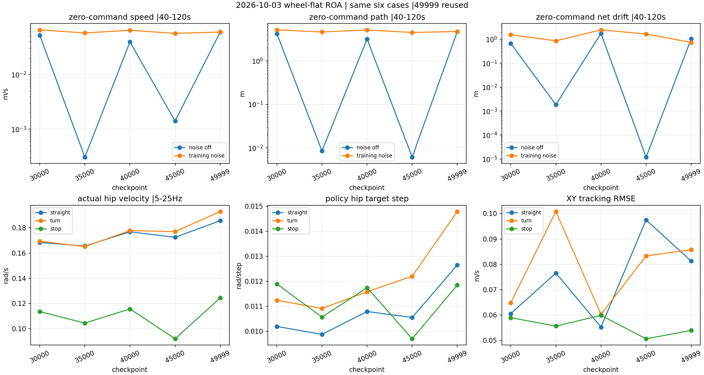
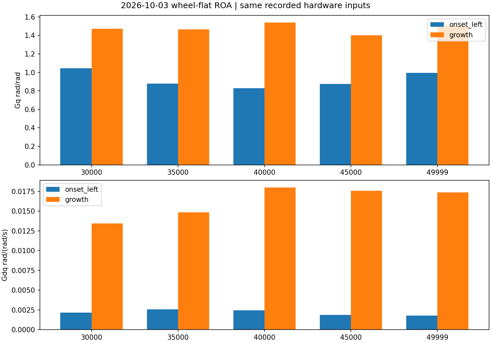

# wheel-flat ROA checkpoint 比较

训练：2026-10-03_22-59-50；30000/35000/40000/45000本次新测，49999复用已完成同协议结果。

**按站定漂移与双髋平顺优先，推荐 model_35000.pt；45000为转弯和停车跟踪备选。**

同一六用例、一环境、seed42、Native学生策略、无视频。每个 checkpoint 两组120秒站定、四组90秒运动；站定指标窗口40–120秒，运动按固定直行/转弯/停车窗口分别统计。所有30个用例已完成且遥测完整，无提前终止。
当前五个点在全部声明指标上均属 Pareto 非支配候选；这里依据用户优先级推荐，不声称所有指标全面最优。

|轮次|无噪声站定累计路径 m|加噪站定累计路径 m|加噪净漂移 m|转弯实际髋5–25Hz RMS rad/s|直行XY RMSE m/s|转弯XY RMSE m/s|
|---|---:|---:|---:|---:|---:|---:|
|30000|4.224577|5.142|1.550|0.1695|0.0606|0.0648|
|**35000 推荐**|0.008512|4.604|0.862|0.1651|0.0766|0.1008|
|40000|3.176812|5.119|2.474|0.1779|0.0553|0.0603|
|45000|0.006134|4.483|1.666|0.1770|0.0975|0.0833|
|49999 复用|4.703446|4.724|0.740|0.1930|0.0813|0.0857|

运动列为左右、15/30ms四用例的算术均值，不是多seed重复或合并RMSE。XY采用既有sqrt(mean(x/y分量误差²))定义，不能直接当作单独vx误差。

|轮次|站定平均速度 无噪声/加噪 m/s|站定实际髋外张模态 无噪声/加噪 °|加噪髋HF rad/s|最差运动髋HF rad/s|
|---|---:|---:|---:|---:|
|30000|0.052234 / 0.065421|1.226 / 1.088|0.1202|0.1802|
|35000|0.000307 / 0.057551|0.363 / 1.325|0.0885|0.1689|
|40000|0.039460 / 0.064301|0.795 / 0.762|0.1120|0.1816|
|45000|0.001403 / 0.056524|0.091 / 1.218|0.1111|0.1974|
|49999|0.059638 / 0.059772|1.150 / 0.993|0.1275|0.1967|

外张模态为实际关节角(qR−qL)/2，按joint_names对应；目标角和实际角分列保存。累计路径来自50Hz世界位置，平均速度来自末物理子步的机体速度；小幅站定时两者不必满足路径=速度×时长。

35000相较最终49999：运动阶段实际髋高频响应均值下降约13.5%，目标一步跳变均值下降约20.2%，加噪站定髋高频响应下降约30.5%。其无噪声站定接近静止；加噪后仍明显漂移，转弯XY跟踪也弱于其余四点，不能视作已解决问题。

45000相较35000：加噪累计路径约小2.6%、转弯/停车跟踪更好、站定髋力矩更低；加噪净漂移约大93.2%，加噪髋HF约高25.5%，最差运动髋HF约高16.9%。按当前偏好保留为备选。

|轮次|实机输入起始段Gq rad/rad|增长段Gq rad/rad|起始段Gdq rad/(rad/s)|增长段Gdq rad/(rad/s)|
|---|---:|---:|---:|---:|
|30000|1.0435|1.4711|0.002155|0.013459|
|35000|0.8792|1.4644|0.002558|0.014849|
|40000|0.8302|1.5385|0.002435|0.018006|
|45000|0.8739|1.3997|0.001860|0.017561|
|49999|0.9954|1.5023|0.001801|0.017361|

实机输入敏感度复用原Sep24事故的同一505帧输入重建；四个新点各49490模型输入向量，最终点复用。Gq/Gdq为当前帧双髋2×2物理目标雅可比的最大奇异值中位数，并非闭环稳定裕度。

单一seed和固定重置只支持本组有限比较；没有数值验收线，正式证据充分性 insufficient_evidence，收敛 indeterminate。

仅可进入受监督实物测试；未经实物验证，不代表 hardware-ready。

以下保留30个原始用例及来源校验链。

# 评估批次 wheel-flat-checkpoint-selection-20261008-001

任务：`RobotLab-Isaac-Velocity-Flat-LW-wheel-Roa-v0`；训练：`2026-10-03_22-59-50`。

本报告汇总已校验的用例；completed 表示证据发布完成，策略表现须结合指标和视频判断。

| 用例 / 尝试 | 状态 | 场景、步数 / 环境 / seed | 遥测 | 结果与视频 |
| --- | --- | --- | --- | --- |
| m30000-right-delay15-noise-a01 | completed | right-delay15-noise，4500 / 1 / 42 | complete | [结果](<../wheel-flat-checkpoint30000-20261008-001/raw/m30000-right-delay15-noise-a01/result.json>) / [日志](<../wheel-flat-checkpoint30000-20261008-001/raw/m30000-right-delay15-noise-a01/console.log>) |
| m30000-left-delay15-noise-a01 | completed | left-delay15-noise，4500 / 1 / 42 | complete | [结果](<../wheel-flat-checkpoint30000-20261008-001/raw/m30000-left-delay15-noise-a01/result.json>) / [日志](<../wheel-flat-checkpoint30000-20261008-001/raw/m30000-left-delay15-noise-a01/console.log>) |
| m30000-right-delay30-noise-a01 | completed | right-delay30-noise，4500 / 1 / 42 | complete | [结果](<../wheel-flat-checkpoint30000-20261008-001/raw/m30000-right-delay30-noise-a01/result.json>) / [日志](<../wheel-flat-checkpoint30000-20261008-001/raw/m30000-right-delay30-noise-a01/console.log>) |
| m30000-left-delay30-noise-a01 | completed | left-delay30-noise，4500 / 1 / 42 | complete | [结果](<../wheel-flat-checkpoint30000-20261008-001/raw/m30000-left-delay30-noise-a01/result.json>) / [日志](<../wheel-flat-checkpoint30000-20261008-001/raw/m30000-left-delay30-noise-a01/console.log>) |
| m30000-nominal-no-noise-a01 | completed | nominal-no-noise，6000 / 1 / 42 | complete | [结果](<../wheel-flat-checkpoint30000-20261008-001/raw/m30000-nominal-no-noise-a01/result.json>) / [日志](<../wheel-flat-checkpoint30000-20261008-001/raw/m30000-nominal-no-noise-a01/console.log>) |
| m30000-nominal-training-noise-a01 | completed | nominal-training-noise，6000 / 1 / 42 | complete | [结果](<../wheel-flat-checkpoint30000-20261008-001/raw/m30000-nominal-training-noise-a01/result.json>) / [日志](<../wheel-flat-checkpoint30000-20261008-001/raw/m30000-nominal-training-noise-a01/console.log>) |
| m35000-right-delay15-noise-a01 | completed | right-delay15-noise，4500 / 1 / 42 | complete | [结果](<../wheel-flat-checkpoint35000-20261008-001/raw/m35000-right-delay15-noise-a01/result.json>) / [日志](<../wheel-flat-checkpoint35000-20261008-001/raw/m35000-right-delay15-noise-a01/console.log>) |
| m35000-left-delay15-noise-a01 | completed | left-delay15-noise，4500 / 1 / 42 | complete | [结果](<../wheel-flat-checkpoint35000-20261008-001/raw/m35000-left-delay15-noise-a01/result.json>) / [日志](<../wheel-flat-checkpoint35000-20261008-001/raw/m35000-left-delay15-noise-a01/console.log>) |
| m35000-right-delay30-noise-a01 | completed | right-delay30-noise，4500 / 1 / 42 | complete | [结果](<../wheel-flat-checkpoint35000-20261008-001/raw/m35000-right-delay30-noise-a01/result.json>) / [日志](<../wheel-flat-checkpoint35000-20261008-001/raw/m35000-right-delay30-noise-a01/console.log>) |
| m35000-left-delay30-noise-a01 | completed | left-delay30-noise，4500 / 1 / 42 | complete | [结果](<../wheel-flat-checkpoint35000-20261008-001/raw/m35000-left-delay30-noise-a01/result.json>) / [日志](<../wheel-flat-checkpoint35000-20261008-001/raw/m35000-left-delay30-noise-a01/console.log>) |
| m35000-nominal-no-noise-a01 | completed | nominal-no-noise，6000 / 1 / 42 | complete | [结果](<../wheel-flat-checkpoint35000-20261008-001/raw/m35000-nominal-no-noise-a01/result.json>) / [日志](<../wheel-flat-checkpoint35000-20261008-001/raw/m35000-nominal-no-noise-a01/console.log>) |
| m35000-nominal-training-noise-a01 | completed | nominal-training-noise，6000 / 1 / 42 | complete | [结果](<../wheel-flat-checkpoint35000-20261008-001/raw/m35000-nominal-training-noise-a01/result.json>) / [日志](<../wheel-flat-checkpoint35000-20261008-001/raw/m35000-nominal-training-noise-a01/console.log>) |
| m40000-right-delay15-noise-a01 | completed | right-delay15-noise，4500 / 1 / 42 | complete | [结果](<../wheel-flat-checkpoint40000-20261008-001/raw/m40000-right-delay15-noise-a01/result.json>) / [日志](<../wheel-flat-checkpoint40000-20261008-001/raw/m40000-right-delay15-noise-a01/console.log>) |
| m40000-left-delay15-noise-a01 | completed | left-delay15-noise，4500 / 1 / 42 | complete | [结果](<../wheel-flat-checkpoint40000-20261008-001/raw/m40000-left-delay15-noise-a01/result.json>) / [日志](<../wheel-flat-checkpoint40000-20261008-001/raw/m40000-left-delay15-noise-a01/console.log>) |
| m40000-right-delay30-noise-a01 | completed | right-delay30-noise，4500 / 1 / 42 | complete | [结果](<../wheel-flat-checkpoint40000-20261008-001/raw/m40000-right-delay30-noise-a01/result.json>) / [日志](<../wheel-flat-checkpoint40000-20261008-001/raw/m40000-right-delay30-noise-a01/console.log>) |
| m40000-left-delay30-noise-a01 | completed | left-delay30-noise，4500 / 1 / 42 | complete | [结果](<../wheel-flat-checkpoint40000-20261008-001/raw/m40000-left-delay30-noise-a01/result.json>) / [日志](<../wheel-flat-checkpoint40000-20261008-001/raw/m40000-left-delay30-noise-a01/console.log>) |
| m40000-nominal-no-noise-a01 | completed | nominal-no-noise，6000 / 1 / 42 | complete | [结果](<../wheel-flat-checkpoint40000-20261008-001/raw/m40000-nominal-no-noise-a01/result.json>) / [日志](<../wheel-flat-checkpoint40000-20261008-001/raw/m40000-nominal-no-noise-a01/console.log>) |
| m40000-nominal-training-noise-a01 | completed | nominal-training-noise，6000 / 1 / 42 | complete | [结果](<../wheel-flat-checkpoint40000-20261008-001/raw/m40000-nominal-training-noise-a01/result.json>) / [日志](<../wheel-flat-checkpoint40000-20261008-001/raw/m40000-nominal-training-noise-a01/console.log>) |
| m45000-right-delay15-noise-a01 | completed | right-delay15-noise，4500 / 1 / 42 | complete | [结果](<../wheel-flat-checkpoint45000-20261008-001/raw/m45000-right-delay15-noise-a01/result.json>) / [日志](<../wheel-flat-checkpoint45000-20261008-001/raw/m45000-right-delay15-noise-a01/console.log>) |
| m45000-left-delay15-noise-a01 | completed | left-delay15-noise，4500 / 1 / 42 | complete | [结果](<../wheel-flat-checkpoint45000-20261008-001/raw/m45000-left-delay15-noise-a01/result.json>) / [日志](<../wheel-flat-checkpoint45000-20261008-001/raw/m45000-left-delay15-noise-a01/console.log>) |
| m45000-right-delay30-noise-a01 | completed | right-delay30-noise，4500 / 1 / 42 | complete | [结果](<../wheel-flat-checkpoint45000-20261008-001/raw/m45000-right-delay30-noise-a01/result.json>) / [日志](<../wheel-flat-checkpoint45000-20261008-001/raw/m45000-right-delay30-noise-a01/console.log>) |
| m45000-left-delay30-noise-a01 | completed | left-delay30-noise，4500 / 1 / 42 | complete | [结果](<../wheel-flat-checkpoint45000-20261008-001/raw/m45000-left-delay30-noise-a01/result.json>) / [日志](<../wheel-flat-checkpoint45000-20261008-001/raw/m45000-left-delay30-noise-a01/console.log>) |
| m45000-nominal-no-noise-a01 | completed | nominal-no-noise，6000 / 1 / 42 | complete | [结果](<../wheel-flat-checkpoint45000-20261008-001/raw/m45000-nominal-no-noise-a01/result.json>) / [日志](<../wheel-flat-checkpoint45000-20261008-001/raw/m45000-nominal-no-noise-a01/console.log>) |
| m45000-nominal-training-noise-a01 | completed | nominal-training-noise，6000 / 1 / 42 | complete | [结果](<../wheel-flat-checkpoint45000-20261008-001/raw/m45000-nominal-training-noise-a01/result.json>) / [日志](<../wheel-flat-checkpoint45000-20261008-001/raw/m45000-nominal-training-noise-a01/console.log>) |
| right-delay15-noise-a01 | completed | right-delay15-noise，4500 / 1 / 42 | complete | [结果](<../wheel-flat-final-std01-20261004-001/raw/right-delay15-noise-a01/result.json>) / [日志](<../wheel-flat-final-std01-20261004-001/raw/right-delay15-noise-a01/console.log>) |
| left-delay15-noise-a01 | completed | left-delay15-noise，4500 / 1 / 42 | complete | [结果](<../wheel-flat-final-std01-20261004-001/raw/left-delay15-noise-a01/result.json>) / [日志](<../wheel-flat-final-std01-20261004-001/raw/left-delay15-noise-a01/console.log>) |
| right-delay30-noise-a01 | completed | right-delay30-noise，4500 / 1 / 42 | complete | [结果](<../wheel-flat-final-std01-20261004-001/raw/right-delay30-noise-a01/result.json>) / [日志](<../wheel-flat-final-std01-20261004-001/raw/right-delay30-noise-a01/console.log>) |
| left-delay30-noise-a01 | completed | left-delay30-noise，4500 / 1 / 42 | complete | [结果](<../wheel-flat-final-std01-20261004-001/raw/left-delay30-noise-a01/result.json>) / [日志](<../wheel-flat-final-std01-20261004-001/raw/left-delay30-noise-a01/console.log>) |
| nominal-no-noise-a01 | completed | nominal-no-noise，6000 / 1 / 42 | complete | [结果](<../wheel-flat-final-std01-20261004-001/raw/nominal-no-noise-a01/result.json>) / [日志](<../wheel-flat-final-std01-20261004-001/raw/nominal-no-noise-a01/console.log>) |
| nominal-training-noise-a01 | completed | nominal-training-noise，6000 / 1 / 42 | complete | [结果](<../wheel-flat-final-std01-20261004-001/raw/nominal-training-noise-a01/result.json>) / [日志](<../wheel-flat-final-std01-20261004-001/raw/nominal-training-noise-a01/console.log>) |

## 策略与场景

- checkpoint SHA-256：`1101d72d83afd812ff780dee00da96da878c2892e6e6ee68f8a7ac75bf1c6c4f`；runner：`OnPolicyRunnerROA`。
- checkpoint SHA-256：`7110fe0bce85f69d191c116f1c6527b3440f5c08d0e8efde7ba669961c8f47f7`；runner：`OnPolicyRunnerROA`。
- checkpoint SHA-256：`8b6105ab017ebdb796b1b2ba185a1137e5ffbafff22a6765978cc176b9556673`；runner：`OnPolicyRunnerROA`。
- checkpoint SHA-256：`986e3a4a16b39c7cec889def629f8057699144a19ef94c1ae876c29947b5ce63`；runner：`OnPolicyRunnerROA`。
- checkpoint SHA-256：`bbbdd43a526481825aa53a3387599728afb3588b5a1214daed7ca5660c991a9f`；runner：`OnPolicyRunnerROA`。
- [场景来源 scenario-076b9ac7cb4a510e48e2bfcbca605bcbc0e3061afeec3db0919977b9f5ec3194.json](<../../provenance/scenario-076b9ac7cb4a510e48e2bfcbca605bcbc0e3061afeec3db0919977b9f5ec3194.json>)
- [场景来源 scenario-0bbdaeac937a877a443b10c3d7013fe801b8fce75f868d8a05fb119ddd25979b.json](<../../provenance/scenario-0bbdaeac937a877a443b10c3d7013fe801b8fce75f868d8a05fb119ddd25979b.json>)
- [场景来源 scenario-0df0e92050380618d4ee34939d9e369b240f59e8881d673d6f9ca5aeefd02184.json](<../../provenance/scenario-0df0e92050380618d4ee34939d9e369b240f59e8881d673d6f9ca5aeefd02184.json>)
- [场景来源 scenario-0ffac2059bb4bdcd6c482bf6556908dd0169cd2dbfe57f8205143222172be7d0.json](<../../provenance/scenario-0ffac2059bb4bdcd6c482bf6556908dd0169cd2dbfe57f8205143222172be7d0.json>)
- [场景来源 scenario-14e95b3d2cec57230bd4940164300f600bf138977dc436e9f8c0fbdf56b96b55.json](<../../provenance/scenario-14e95b3d2cec57230bd4940164300f600bf138977dc436e9f8c0fbdf56b96b55.json>)
- [场景来源 scenario-27b8a334aaa6c83c8386450d127ec465e9ad2444221b8dcab9b7ccd51dc8ede2.json](<../../provenance/scenario-27b8a334aaa6c83c8386450d127ec465e9ad2444221b8dcab9b7ccd51dc8ede2.json>)
- [场景来源 scenario-8bebc8bad6fa19e4d1400fccaae71eee791be618f11ae8bc6ba34f63b014b304.json](<../../provenance/scenario-8bebc8bad6fa19e4d1400fccaae71eee791be618f11ae8bc6ba34f63b014b304.json>)
- [场景来源 scenario-a0d5942f380d6fcfd34ea8b6e6c2422c16d9756c69691fd29732a4d59310d7a5.json](<../../provenance/scenario-a0d5942f380d6fcfd34ea8b6e6c2422c16d9756c69691fd29732a4d59310d7a5.json>)
- [场景来源 scenario-a3b853b86945e4d1bac7acd2d254fc763ca54e2e52ce82f483a1130653d09243.json](<../../provenance/scenario-a3b853b86945e4d1bac7acd2d254fc763ca54e2e52ce82f483a1130653d09243.json>)
- [场景来源 scenario-c0260e519763583fc0ddcdb1ffaa5a264690944fc8fb6665dd0feab662cf6ec5.json](<../../provenance/scenario-c0260e519763583fc0ddcdb1ffaa5a264690944fc8fb6665dd0feab662cf6ec5.json>)
- [场景来源 scenario-d023d66401a597b8d73a1c269a9353c42091d33ce9a7c130f933d05cec8cca5e.json](<../../provenance/scenario-d023d66401a597b8d73a1c269a9353c42091d33ce9a7c130f933d05cec8cca5e.json>)
- [场景来源 scenario-f230095a48bbd23c07682f8fd6a827c796ce04975751a8f0f8fce01e65127480.json](<../../provenance/scenario-f230095a48bbd23c07682f8fd6a827c796ce04975751a8f0f8fce01e65127480.json>)
- [训练上下文 context-38a50c3610d7b191acd00b852ed66a027cff24dd507445209fda373a3adad85f.json](<../../provenance/context-38a50c3610d7b191acd00b852ed66a027cff24dd507445209fda373a3adad85f.json>)
- [训练上下文 context-b9ade10e91b02f069d3cd0374e17542204e2d4bfec7038e1dd2330cc432590ca.json](<../../provenance/context-b9ade10e91b02f069d3cd0374e17542204e2d4bfec7038e1dd2330cc432590ca.json>)
- [训练有效配置 config-589ab57be35e67198ec2ad47c3fbc2f9a3af72618d6dd9ede503225de10a192d.json](<../../provenance/config-589ab57be35e67198ec2ad47c3fbc2f9a3af72618d6dd9ede503225de10a192d.json>)

- `m30000-right-delay15-noise-a01` 指标：`{"max_joint_velocity_utilization": 0.3291517026496656, "max_tilt": 0.11714107543230057, "termination_rate": 0.0, "tracking_xy_rmse": 0.06202523801896219, "tracking_yaw_rmse": 0.23798710837479117}`
- `m30000-right-delay15-noise-a01` 命令调度：`[{"command": [0, 0, 0], "end_step": 499, "start_step": 0}, {"command": [0.5, 0, 0], "end_step": 1999, "start_step": 500}, {"command": [0.5, 0, -0.6], "end_step": 3499, "start_step": 2000}, {"command": [0, 0, 0], "end_step": 4499, "start_step": 3500}]`；训练配置覆盖：`{"curriculum.terrain_levels": null, "episode_length_s": 120.0, "evaluation.roa_mode": "student", "events.add_joint_default_pos": null, "events.randomize_actuator_gains": null, "events.randomize_com_positions": null, "events.randomize_push_robot": null, "events.randomize_reset_base.params.pose_range": {"pitch": [0.0, 0.0], "roll": [0.0, 0.0], "x": [0.0, 0.0], "y": [0.0, 0.0], "yaw": [0.0, 0.0], "z": [0.0, 0.0]}, "events.randomize_reset_base.params.velocity_range": {"pitch": [0.0, 0.0], "roll": [0.0, 0.0], "x": [0.0, 0.0], "y": [0.0, 0.0], "yaw": [0.0, 0.0], "z": [0.0, 0.0]}, "events.randomize_reset_joints.params.position_range": [0.0, 0.0], "events.randomize_reset_joints.params.velocity_range": [0.0, 0.0], "events.randomize_rigid_body_mass_base": null, "events.randomize_rigid_body_mass_others": null, "events.randomize_rigid_body_material.params.dynamic_friction_range": [1.0, 1.0], "events.randomize_rigid_body_material.params.restitution_range": [0.0, 0.0], "events.randomize_rigid_body_material.params.static_friction_range": [1.0, 1.0], "observations.policy.enable_corruption": true, "scene.robot.actuators.foots.max_delay": 3, "scene.robot.actuators.foots.min_delay": 3, "scene.robot.actuators.legs.max_delay": 3, "scene.robot.actuators.legs.min_delay": 3, "scene.robot.actuators.wheels.max_delay": 3, "scene.robot.actuators.wheels.min_delay": 3, "scene.terrain.terrain_generator": null, "scene.terrain.terrain_type": "plane", "terminations.terrain_out_of_bounds": null}`。
- `m30000-left-delay15-noise-a01` 指标：`{"max_joint_velocity_utilization": 0.3400427500406901, "max_tilt": 0.11360258609056473, "termination_rate": 0.0, "tracking_xy_rmse": 0.07097074056875881, "tracking_yaw_rmse": 0.23400372538866476}`
- `m30000-left-delay15-noise-a01` 命令调度：`[{"command": [0, 0, 0], "end_step": 499, "start_step": 0}, {"command": [0.5, 0, 0], "end_step": 1999, "start_step": 500}, {"command": [0.5, 0, 0.6], "end_step": 3499, "start_step": 2000}, {"command": [0, 0, 0], "end_step": 4499, "start_step": 3500}]`；训练配置覆盖：`{"curriculum.terrain_levels": null, "episode_length_s": 120.0, "evaluation.roa_mode": "student", "events.add_joint_default_pos": null, "events.randomize_actuator_gains": null, "events.randomize_com_positions": null, "events.randomize_push_robot": null, "events.randomize_reset_base.params.pose_range": {"pitch": [0.0, 0.0], "roll": [0.0, 0.0], "x": [0.0, 0.0], "y": [0.0, 0.0], "yaw": [0.0, 0.0], "z": [0.0, 0.0]}, "events.randomize_reset_base.params.velocity_range": {"pitch": [0.0, 0.0], "roll": [0.0, 0.0], "x": [0.0, 0.0], "y": [0.0, 0.0], "yaw": [0.0, 0.0], "z": [0.0, 0.0]}, "events.randomize_reset_joints.params.position_range": [0.0, 0.0], "events.randomize_reset_joints.params.velocity_range": [0.0, 0.0], "events.randomize_rigid_body_mass_base": null, "events.randomize_rigid_body_mass_others": null, "events.randomize_rigid_body_material.params.dynamic_friction_range": [1.0, 1.0], "events.randomize_rigid_body_material.params.restitution_range": [0.0, 0.0], "events.randomize_rigid_body_material.params.static_friction_range": [1.0, 1.0], "observations.policy.enable_corruption": true, "scene.robot.actuators.foots.max_delay": 3, "scene.robot.actuators.foots.min_delay": 3, "scene.robot.actuators.legs.max_delay": 3, "scene.robot.actuators.legs.min_delay": 3, "scene.robot.actuators.wheels.max_delay": 3, "scene.robot.actuators.wheels.min_delay": 3, "scene.terrain.terrain_generator": null, "scene.terrain.terrain_type": "plane", "terminations.terrain_out_of_bounds": null}`。
- `m30000-right-delay30-noise-a01` 指标：`{"max_joint_velocity_utilization": 0.494826602935791, "max_tilt": 0.20035108923912048, "termination_rate": 0.0, "tracking_xy_rmse": 0.06953543357060776, "tracking_yaw_rmse": 0.23985987514923157}`
- `m30000-right-delay30-noise-a01` 命令调度：`[{"command": [0, 0, 0], "end_step": 499, "start_step": 0}, {"command": [0.5, 0, 0], "end_step": 1999, "start_step": 500}, {"command": [0.5, 0, -0.6], "end_step": 3499, "start_step": 2000}, {"command": [0, 0, 0], "end_step": 4499, "start_step": 3500}]`；训练配置覆盖：`{"curriculum.terrain_levels": null, "episode_length_s": 120.0, "evaluation.roa_mode": "student", "events.add_joint_default_pos": null, "events.randomize_actuator_gains": null, "events.randomize_com_positions": null, "events.randomize_push_robot": null, "events.randomize_reset_base.params.pose_range": {"pitch": [0.0, 0.0], "roll": [0.0, 0.0], "x": [0.0, 0.0], "y": [0.0, 0.0], "yaw": [0.0, 0.0], "z": [0.0, 0.0]}, "events.randomize_reset_base.params.velocity_range": {"pitch": [0.0, 0.0], "roll": [0.0, 0.0], "x": [0.0, 0.0], "y": [0.0, 0.0], "yaw": [0.0, 0.0], "z": [0.0, 0.0]}, "events.randomize_reset_joints.params.position_range": [0.0, 0.0], "events.randomize_reset_joints.params.velocity_range": [0.0, 0.0], "events.randomize_rigid_body_mass_base": null, "events.randomize_rigid_body_mass_others": null, "events.randomize_rigid_body_material.params.dynamic_friction_range": [1.0, 1.0], "events.randomize_rigid_body_material.params.restitution_range": [0.0, 0.0], "events.randomize_rigid_body_material.params.static_friction_range": [1.0, 1.0], "observations.policy.enable_corruption": true, "scene.robot.actuators.foots.max_delay": 6, "scene.robot.actuators.foots.min_delay": 6, "scene.robot.actuators.legs.max_delay": 6, "scene.robot.actuators.legs.min_delay": 6, "scene.robot.actuators.wheels.max_delay": 6, "scene.robot.actuators.wheels.min_delay": 6, "scene.terrain.terrain_generator": null, "scene.terrain.terrain_type": "plane", "terminations.terrain_out_of_bounds": null}`。
- `m30000-left-delay30-noise-a01` 指标：`{"max_joint_velocity_utilization": 0.494826602935791, "max_tilt": 0.20035108923912048, "termination_rate": 0.0, "tracking_xy_rmse": 0.0756287563815023, "tracking_yaw_rmse": 0.23443084046351273}`
- `m30000-left-delay30-noise-a01` 命令调度：`[{"command": [0, 0, 0], "end_step": 499, "start_step": 0}, {"command": [0.5, 0, 0], "end_step": 1999, "start_step": 500}, {"command": [0.5, 0, 0.6], "end_step": 3499, "start_step": 2000}, {"command": [0, 0, 0], "end_step": 4499, "start_step": 3500}]`；训练配置覆盖：`{"curriculum.terrain_levels": null, "episode_length_s": 120.0, "evaluation.roa_mode": "student", "events.add_joint_default_pos": null, "events.randomize_actuator_gains": null, "events.randomize_com_positions": null, "events.randomize_push_robot": null, "events.randomize_reset_base.params.pose_range": {"pitch": [0.0, 0.0], "roll": [0.0, 0.0], "x": [0.0, 0.0], "y": [0.0, 0.0], "yaw": [0.0, 0.0], "z": [0.0, 0.0]}, "events.randomize_reset_base.params.velocity_range": {"pitch": [0.0, 0.0], "roll": [0.0, 0.0], "x": [0.0, 0.0], "y": [0.0, 0.0], "yaw": [0.0, 0.0], "z": [0.0, 0.0]}, "events.randomize_reset_joints.params.position_range": [0.0, 0.0], "events.randomize_reset_joints.params.velocity_range": [0.0, 0.0], "events.randomize_rigid_body_mass_base": null, "events.randomize_rigid_body_mass_others": null, "events.randomize_rigid_body_material.params.dynamic_friction_range": [1.0, 1.0], "events.randomize_rigid_body_material.params.restitution_range": [0.0, 0.0], "events.randomize_rigid_body_material.params.static_friction_range": [1.0, 1.0], "observations.policy.enable_corruption": true, "scene.robot.actuators.foots.max_delay": 6, "scene.robot.actuators.foots.min_delay": 6, "scene.robot.actuators.legs.max_delay": 6, "scene.robot.actuators.legs.min_delay": 6, "scene.robot.actuators.wheels.max_delay": 6, "scene.robot.actuators.wheels.min_delay": 6, "scene.terrain.terrain_generator": null, "scene.terrain.terrain_type": "plane", "terminations.terrain_out_of_bounds": null}`。
- `m30000-nominal-no-noise-a01` 指标：`{"max_joint_velocity_utilization": 0.22931731830943713, "max_tilt": 0.07710200548171997, "termination_rate": 0.0, "tracking_xy_rmse": 0.042660568884902626, "tracking_yaw_rmse": 0.041110434735541955}`
- `m30000-nominal-no-noise-a01` 命令调度：`[{"command": [0, 0, 0], "end_step": 5999, "start_step": 0}]`；训练配置覆盖：`{"curriculum.terrain_levels": null, "episode_length_s": 150.0, "events.add_joint_default_pos": null, "events.randomize_actuator_gains": null, "events.randomize_com_positions": null, "events.randomize_push_robot": null, "events.randomize_reset_base.params.pose_range": {"pitch": [0.0, 0.0], "roll": [0.0, 0.0], "x": [0.0, 0.0], "y": [0.0, 0.0], "yaw": [0.0, 0.0], "z": [0.0, 0.0]}, "events.randomize_reset_base.params.velocity_range": {"pitch": [0.0, 0.0], "roll": [0.0, 0.0], "x": [0.0, 0.0], "y": [0.0, 0.0], "yaw": [0.0, 0.0], "z": [0.0, 0.0]}, "events.randomize_reset_joints.params.position_range": [0.0, 0.0], "events.randomize_reset_joints.params.velocity_range": [0.0, 0.0], "events.randomize_rigid_body_mass_base": null, "events.randomize_rigid_body_mass_others": null, "events.randomize_rigid_body_material.params.dynamic_friction_range": [1.0, 1.0], "events.randomize_rigid_body_material.params.restitution_range": [0.0, 0.0], "events.randomize_rigid_body_material.params.static_friction_range": [1.0, 1.0], "observations.policy.enable_corruption": false, "scene.robot.actuators.foots.max_delay": 0, "scene.robot.actuators.foots.min_delay": 0, "scene.robot.actuators.legs.max_delay": 0, "scene.robot.actuators.legs.min_delay": 0, "scene.robot.actuators.wheels.max_delay": 0, "scene.robot.actuators.wheels.min_delay": 0, "scene.terrain.terrain_generator": null, "scene.terrain.terrain_type": "plane", "terminations.terrain_out_of_bounds": null}`。
- `m30000-nominal-training-noise-a01` 指标：`{"max_joint_velocity_utilization": 0.2568387118252841, "max_tilt": 0.09041888266801834, "termination_rate": 0.0, "tracking_xy_rmse": 0.052736794270947414, "tracking_yaw_rmse": 0.05226185221838844}`
- `m30000-nominal-training-noise-a01` 命令调度：`[{"command": [0, 0, 0], "end_step": 5999, "start_step": 0}]`；训练配置覆盖：`{"curriculum.terrain_levels": null, "episode_length_s": 150.0, "events.add_joint_default_pos": null, "events.randomize_actuator_gains": null, "events.randomize_com_positions": null, "events.randomize_push_robot": null, "events.randomize_reset_base.params.pose_range": {"pitch": [0.0, 0.0], "roll": [0.0, 0.0], "x": [0.0, 0.0], "y": [0.0, 0.0], "yaw": [0.0, 0.0], "z": [0.0, 0.0]}, "events.randomize_reset_base.params.velocity_range": {"pitch": [0.0, 0.0], "roll": [0.0, 0.0], "x": [0.0, 0.0], "y": [0.0, 0.0], "yaw": [0.0, 0.0], "z": [0.0, 0.0]}, "events.randomize_reset_joints.params.position_range": [0.0, 0.0], "events.randomize_reset_joints.params.velocity_range": [0.0, 0.0], "events.randomize_rigid_body_mass_base": null, "events.randomize_rigid_body_mass_others": null, "events.randomize_rigid_body_material.params.dynamic_friction_range": [1.0, 1.0], "events.randomize_rigid_body_material.params.restitution_range": [0.0, 0.0], "events.randomize_rigid_body_material.params.static_friction_range": [1.0, 1.0], "observations.policy.enable_corruption": true, "scene.robot.actuators.foots.max_delay": 0, "scene.robot.actuators.foots.min_delay": 0, "scene.robot.actuators.legs.max_delay": 0, "scene.robot.actuators.legs.min_delay": 0, "scene.robot.actuators.wheels.max_delay": 0, "scene.robot.actuators.wheels.min_delay": 0, "scene.terrain.terrain_generator": null, "scene.terrain.terrain_type": "plane", "terminations.terrain_out_of_bounds": null}`。
- `m35000-right-delay15-noise-a01` 指标：`{"max_joint_velocity_utilization": 0.33865515391031903, "max_tilt": 0.11529891937971115, "termination_rate": 0.0, "tracking_xy_rmse": 0.0861528053666154, "tracking_yaw_rmse": 0.24130691352220085}`
- `m35000-right-delay15-noise-a01` 命令调度：`[{"command": [0, 0, 0], "end_step": 499, "start_step": 0}, {"command": [0.5, 0, 0], "end_step": 1999, "start_step": 500}, {"command": [0.5, 0, -0.6], "end_step": 3499, "start_step": 2000}, {"command": [0, 0, 0], "end_step": 4499, "start_step": 3500}]`；训练配置覆盖：`{"curriculum.terrain_levels": null, "episode_length_s": 120.0, "evaluation.roa_mode": "student", "events.add_joint_default_pos": null, "events.randomize_actuator_gains": null, "events.randomize_com_positions": null, "events.randomize_push_robot": null, "events.randomize_reset_base.params.pose_range": {"pitch": [0.0, 0.0], "roll": [0.0, 0.0], "x": [0.0, 0.0], "y": [0.0, 0.0], "yaw": [0.0, 0.0], "z": [0.0, 0.0]}, "events.randomize_reset_base.params.velocity_range": {"pitch": [0.0, 0.0], "roll": [0.0, 0.0], "x": [0.0, 0.0], "y": [0.0, 0.0], "yaw": [0.0, 0.0], "z": [0.0, 0.0]}, "events.randomize_reset_joints.params.position_range": [0.0, 0.0], "events.randomize_reset_joints.params.velocity_range": [0.0, 0.0], "events.randomize_rigid_body_mass_base": null, "events.randomize_rigid_body_mass_others": null, "events.randomize_rigid_body_material.params.dynamic_friction_range": [1.0, 1.0], "events.randomize_rigid_body_material.params.restitution_range": [0.0, 0.0], "events.randomize_rigid_body_material.params.static_friction_range": [1.0, 1.0], "observations.policy.enable_corruption": true, "scene.robot.actuators.foots.max_delay": 3, "scene.robot.actuators.foots.min_delay": 3, "scene.robot.actuators.legs.max_delay": 3, "scene.robot.actuators.legs.min_delay": 3, "scene.robot.actuators.wheels.max_delay": 3, "scene.robot.actuators.wheels.min_delay": 3, "scene.terrain.terrain_generator": null, "scene.terrain.terrain_type": "plane", "terminations.terrain_out_of_bounds": null}`。
- `m35000-left-delay15-noise-a01` 指标：`{"max_joint_velocity_utilization": 0.33627804842862213, "max_tilt": 0.10603883862495422, "termination_rate": 0.0, "tracking_xy_rmse": 0.08104755403943013, "tracking_yaw_rmse": 0.2515141426377712}`
- `m35000-left-delay15-noise-a01` 命令调度：`[{"command": [0, 0, 0], "end_step": 499, "start_step": 0}, {"command": [0.5, 0, 0], "end_step": 1999, "start_step": 500}, {"command": [0.5, 0, 0.6], "end_step": 3499, "start_step": 2000}, {"command": [0, 0, 0], "end_step": 4499, "start_step": 3500}]`；训练配置覆盖：`{"curriculum.terrain_levels": null, "episode_length_s": 120.0, "evaluation.roa_mode": "student", "events.add_joint_default_pos": null, "events.randomize_actuator_gains": null, "events.randomize_com_positions": null, "events.randomize_push_robot": null, "events.randomize_reset_base.params.pose_range": {"pitch": [0.0, 0.0], "roll": [0.0, 0.0], "x": [0.0, 0.0], "y": [0.0, 0.0], "yaw": [0.0, 0.0], "z": [0.0, 0.0]}, "events.randomize_reset_base.params.velocity_range": {"pitch": [0.0, 0.0], "roll": [0.0, 0.0], "x": [0.0, 0.0], "y": [0.0, 0.0], "yaw": [0.0, 0.0], "z": [0.0, 0.0]}, "events.randomize_reset_joints.params.position_range": [0.0, 0.0], "events.randomize_reset_joints.params.velocity_range": [0.0, 0.0], "events.randomize_rigid_body_mass_base": null, "events.randomize_rigid_body_mass_others": null, "events.randomize_rigid_body_material.params.dynamic_friction_range": [1.0, 1.0], "events.randomize_rigid_body_material.params.restitution_range": [0.0, 0.0], "events.randomize_rigid_body_material.params.static_friction_range": [1.0, 1.0], "observations.policy.enable_corruption": true, "scene.robot.actuators.foots.max_delay": 3, "scene.robot.actuators.foots.min_delay": 3, "scene.robot.actuators.legs.max_delay": 3, "scene.robot.actuators.legs.min_delay": 3, "scene.robot.actuators.wheels.max_delay": 3, "scene.robot.actuators.wheels.min_delay": 3, "scene.terrain.terrain_generator": null, "scene.terrain.terrain_type": "plane", "terminations.terrain_out_of_bounds": null}`。
- `m35000-right-delay30-noise-a01` 指标：`{"max_joint_velocity_utilization": 0.46837267875671384, "max_tilt": 0.19606554508209229, "termination_rate": 0.0, "tracking_xy_rmse": 0.08876153706261382, "tracking_yaw_rmse": 0.2384612189153764}`
- `m35000-right-delay30-noise-a01` 命令调度：`[{"command": [0, 0, 0], "end_step": 499, "start_step": 0}, {"command": [0.5, 0, 0], "end_step": 1999, "start_step": 500}, {"command": [0.5, 0, -0.6], "end_step": 3499, "start_step": 2000}, {"command": [0, 0, 0], "end_step": 4499, "start_step": 3500}]`；训练配置覆盖：`{"curriculum.terrain_levels": null, "episode_length_s": 120.0, "evaluation.roa_mode": "student", "events.add_joint_default_pos": null, "events.randomize_actuator_gains": null, "events.randomize_com_positions": null, "events.randomize_push_robot": null, "events.randomize_reset_base.params.pose_range": {"pitch": [0.0, 0.0], "roll": [0.0, 0.0], "x": [0.0, 0.0], "y": [0.0, 0.0], "yaw": [0.0, 0.0], "z": [0.0, 0.0]}, "events.randomize_reset_base.params.velocity_range": {"pitch": [0.0, 0.0], "roll": [0.0, 0.0], "x": [0.0, 0.0], "y": [0.0, 0.0], "yaw": [0.0, 0.0], "z": [0.0, 0.0]}, "events.randomize_reset_joints.params.position_range": [0.0, 0.0], "events.randomize_reset_joints.params.velocity_range": [0.0, 0.0], "events.randomize_rigid_body_mass_base": null, "events.randomize_rigid_body_mass_others": null, "events.randomize_rigid_body_material.params.dynamic_friction_range": [1.0, 1.0], "events.randomize_rigid_body_material.params.restitution_range": [0.0, 0.0], "events.randomize_rigid_body_material.params.static_friction_range": [1.0, 1.0], "observations.policy.enable_corruption": true, "scene.robot.actuators.foots.max_delay": 6, "scene.robot.actuators.foots.min_delay": 6, "scene.robot.actuators.legs.max_delay": 6, "scene.robot.actuators.legs.min_delay": 6, "scene.robot.actuators.wheels.max_delay": 6, "scene.robot.actuators.wheels.min_delay": 6, "scene.terrain.terrain_generator": null, "scene.terrain.terrain_type": "plane", "terminations.terrain_out_of_bounds": null}`。
- `m35000-left-delay30-noise-a01` 指标：`{"max_joint_velocity_utilization": 0.46837267875671384, "max_tilt": 0.19606554508209229, "termination_rate": 0.0, "tracking_xy_rmse": 0.0830456079732114, "tracking_yaw_rmse": 0.25418400567071625}`
- `m35000-left-delay30-noise-a01` 命令调度：`[{"command": [0, 0, 0], "end_step": 499, "start_step": 0}, {"command": [0.5, 0, 0], "end_step": 1999, "start_step": 500}, {"command": [0.5, 0, 0.6], "end_step": 3499, "start_step": 2000}, {"command": [0, 0, 0], "end_step": 4499, "start_step": 3500}]`；训练配置覆盖：`{"curriculum.terrain_levels": null, "episode_length_s": 120.0, "evaluation.roa_mode": "student", "events.add_joint_default_pos": null, "events.randomize_actuator_gains": null, "events.randomize_com_positions": null, "events.randomize_push_robot": null, "events.randomize_reset_base.params.pose_range": {"pitch": [0.0, 0.0], "roll": [0.0, 0.0], "x": [0.0, 0.0], "y": [0.0, 0.0], "yaw": [0.0, 0.0], "z": [0.0, 0.0]}, "events.randomize_reset_base.params.velocity_range": {"pitch": [0.0, 0.0], "roll": [0.0, 0.0], "x": [0.0, 0.0], "y": [0.0, 0.0], "yaw": [0.0, 0.0], "z": [0.0, 0.0]}, "events.randomize_reset_joints.params.position_range": [0.0, 0.0], "events.randomize_reset_joints.params.velocity_range": [0.0, 0.0], "events.randomize_rigid_body_mass_base": null, "events.randomize_rigid_body_mass_others": null, "events.randomize_rigid_body_material.params.dynamic_friction_range": [1.0, 1.0], "events.randomize_rigid_body_material.params.restitution_range": [0.0, 0.0], "events.randomize_rigid_body_material.params.static_friction_range": [1.0, 1.0], "observations.policy.enable_corruption": true, "scene.robot.actuators.foots.max_delay": 6, "scene.robot.actuators.foots.min_delay": 6, "scene.robot.actuators.legs.max_delay": 6, "scene.robot.actuators.legs.min_delay": 6, "scene.robot.actuators.wheels.max_delay": 6, "scene.robot.actuators.wheels.min_delay": 6, "scene.terrain.terrain_generator": null, "scene.terrain.terrain_type": "plane", "terminations.terrain_out_of_bounds": null}`。
- `m35000-nominal-no-noise-a01` 指标：`{"max_joint_velocity_utilization": 0.2133704662322998, "max_tilt": 0.052133191376924515, "termination_rate": 0.0, "tracking_xy_rmse": 0.003282494625982974, "tracking_yaw_rmse": 0.006392143992086506}`
- `m35000-nominal-no-noise-a01` 命令调度：`[{"command": [0, 0, 0], "end_step": 5999, "start_step": 0}]`；训练配置覆盖：`{"curriculum.terrain_levels": null, "episode_length_s": 150.0, "events.add_joint_default_pos": null, "events.randomize_actuator_gains": null, "events.randomize_com_positions": null, "events.randomize_push_robot": null, "events.randomize_reset_base.params.pose_range": {"pitch": [0.0, 0.0], "roll": [0.0, 0.0], "x": [0.0, 0.0], "y": [0.0, 0.0], "yaw": [0.0, 0.0], "z": [0.0, 0.0]}, "events.randomize_reset_base.params.velocity_range": {"pitch": [0.0, 0.0], "roll": [0.0, 0.0], "x": [0.0, 0.0], "y": [0.0, 0.0], "yaw": [0.0, 0.0], "z": [0.0, 0.0]}, "events.randomize_reset_joints.params.position_range": [0.0, 0.0], "events.randomize_reset_joints.params.velocity_range": [0.0, 0.0], "events.randomize_rigid_body_mass_base": null, "events.randomize_rigid_body_mass_others": null, "events.randomize_rigid_body_material.params.dynamic_friction_range": [1.0, 1.0], "events.randomize_rigid_body_material.params.restitution_range": [0.0, 0.0], "events.randomize_rigid_body_material.params.static_friction_range": [1.0, 1.0], "observations.policy.enable_corruption": false, "scene.robot.actuators.foots.max_delay": 0, "scene.robot.actuators.foots.min_delay": 0, "scene.robot.actuators.legs.max_delay": 0, "scene.robot.actuators.legs.min_delay": 0, "scene.robot.actuators.wheels.max_delay": 0, "scene.robot.actuators.wheels.min_delay": 0, "scene.terrain.terrain_generator": null, "scene.terrain.terrain_type": "plane", "terminations.terrain_out_of_bounds": null}`。
- `m35000-nominal-training-noise-a01` 指标：`{"max_joint_velocity_utilization": 0.23729753494262695, "max_tilt": 0.09786500781774521, "termination_rate": 0.0, "tracking_xy_rmse": 0.04558602829407866, "tracking_yaw_rmse": 0.04096876547171049}`
- `m35000-nominal-training-noise-a01` 命令调度：`[{"command": [0, 0, 0], "end_step": 5999, "start_step": 0}]`；训练配置覆盖：`{"curriculum.terrain_levels": null, "episode_length_s": 150.0, "events.add_joint_default_pos": null, "events.randomize_actuator_gains": null, "events.randomize_com_positions": null, "events.randomize_push_robot": null, "events.randomize_reset_base.params.pose_range": {"pitch": [0.0, 0.0], "roll": [0.0, 0.0], "x": [0.0, 0.0], "y": [0.0, 0.0], "yaw": [0.0, 0.0], "z": [0.0, 0.0]}, "events.randomize_reset_base.params.velocity_range": {"pitch": [0.0, 0.0], "roll": [0.0, 0.0], "x": [0.0, 0.0], "y": [0.0, 0.0], "yaw": [0.0, 0.0], "z": [0.0, 0.0]}, "events.randomize_reset_joints.params.position_range": [0.0, 0.0], "events.randomize_reset_joints.params.velocity_range": [0.0, 0.0], "events.randomize_rigid_body_mass_base": null, "events.randomize_rigid_body_mass_others": null, "events.randomize_rigid_body_material.params.dynamic_friction_range": [1.0, 1.0], "events.randomize_rigid_body_material.params.restitution_range": [0.0, 0.0], "events.randomize_rigid_body_material.params.static_friction_range": [1.0, 1.0], "observations.policy.enable_corruption": true, "scene.robot.actuators.foots.max_delay": 0, "scene.robot.actuators.foots.min_delay": 0, "scene.robot.actuators.legs.max_delay": 0, "scene.robot.actuators.legs.min_delay": 0, "scene.robot.actuators.wheels.max_delay": 0, "scene.robot.actuators.wheels.min_delay": 0, "scene.terrain.terrain_generator": null, "scene.terrain.terrain_type": "plane", "terminations.terrain_out_of_bounds": null}`。
- `m40000-right-delay15-noise-a01` 指标：`{"max_joint_velocity_utilization": 0.37810857368238043, "max_tilt": 0.11915194243192673, "termination_rate": 0.0, "tracking_xy_rmse": 0.06418725842630842, "tracking_yaw_rmse": 0.2712773297881224}`
- `m40000-right-delay15-noise-a01` 命令调度：`[{"command": [0, 0, 0], "end_step": 499, "start_step": 0}, {"command": [0.5, 0, 0], "end_step": 1999, "start_step": 500}, {"command": [0.5, 0, -0.6], "end_step": 3499, "start_step": 2000}, {"command": [0, 0, 0], "end_step": 4499, "start_step": 3500}]`；训练配置覆盖：`{"curriculum.terrain_levels": null, "episode_length_s": 120.0, "evaluation.roa_mode": "student", "events.add_joint_default_pos": null, "events.randomize_actuator_gains": null, "events.randomize_com_positions": null, "events.randomize_push_robot": null, "events.randomize_reset_base.params.pose_range": {"pitch": [0.0, 0.0], "roll": [0.0, 0.0], "x": [0.0, 0.0], "y": [0.0, 0.0], "yaw": [0.0, 0.0], "z": [0.0, 0.0]}, "events.randomize_reset_base.params.velocity_range": {"pitch": [0.0, 0.0], "roll": [0.0, 0.0], "x": [0.0, 0.0], "y": [0.0, 0.0], "yaw": [0.0, 0.0], "z": [0.0, 0.0]}, "events.randomize_reset_joints.params.position_range": [0.0, 0.0], "events.randomize_reset_joints.params.velocity_range": [0.0, 0.0], "events.randomize_rigid_body_mass_base": null, "events.randomize_rigid_body_mass_others": null, "events.randomize_rigid_body_material.params.dynamic_friction_range": [1.0, 1.0], "events.randomize_rigid_body_material.params.restitution_range": [0.0, 0.0], "events.randomize_rigid_body_material.params.static_friction_range": [1.0, 1.0], "observations.policy.enable_corruption": true, "scene.robot.actuators.foots.max_delay": 3, "scene.robot.actuators.foots.min_delay": 3, "scene.robot.actuators.legs.max_delay": 3, "scene.robot.actuators.legs.min_delay": 3, "scene.robot.actuators.wheels.max_delay": 3, "scene.robot.actuators.wheels.min_delay": 3, "scene.terrain.terrain_generator": null, "scene.terrain.terrain_type": "plane", "terminations.terrain_out_of_bounds": null}`。
- `m40000-left-delay15-noise-a01` 指标：`{"max_joint_velocity_utilization": 0.37931592536695075, "max_tilt": 0.11915194243192673, "termination_rate": 0.0, "tracking_xy_rmse": 0.06679914377713231, "tracking_yaw_rmse": 0.25922557430083604}`
- `m40000-left-delay15-noise-a01` 命令调度：`[{"command": [0, 0, 0], "end_step": 499, "start_step": 0}, {"command": [0.5, 0, 0], "end_step": 1999, "start_step": 500}, {"command": [0.5, 0, 0.6], "end_step": 3499, "start_step": 2000}, {"command": [0, 0, 0], "end_step": 4499, "start_step": 3500}]`；训练配置覆盖：`{"curriculum.terrain_levels": null, "episode_length_s": 120.0, "evaluation.roa_mode": "student", "events.add_joint_default_pos": null, "events.randomize_actuator_gains": null, "events.randomize_com_positions": null, "events.randomize_push_robot": null, "events.randomize_reset_base.params.pose_range": {"pitch": [0.0, 0.0], "roll": [0.0, 0.0], "x": [0.0, 0.0], "y": [0.0, 0.0], "yaw": [0.0, 0.0], "z": [0.0, 0.0]}, "events.randomize_reset_base.params.velocity_range": {"pitch": [0.0, 0.0], "roll": [0.0, 0.0], "x": [0.0, 0.0], "y": [0.0, 0.0], "yaw": [0.0, 0.0], "z": [0.0, 0.0]}, "events.randomize_reset_joints.params.position_range": [0.0, 0.0], "events.randomize_reset_joints.params.velocity_range": [0.0, 0.0], "events.randomize_rigid_body_mass_base": null, "events.randomize_rigid_body_mass_others": null, "events.randomize_rigid_body_material.params.dynamic_friction_range": [1.0, 1.0], "events.randomize_rigid_body_material.params.restitution_range": [0.0, 0.0], "events.randomize_rigid_body_material.params.static_friction_range": [1.0, 1.0], "observations.policy.enable_corruption": true, "scene.robot.actuators.foots.max_delay": 3, "scene.robot.actuators.foots.min_delay": 3, "scene.robot.actuators.legs.max_delay": 3, "scene.robot.actuators.legs.min_delay": 3, "scene.robot.actuators.wheels.max_delay": 3, "scene.robot.actuators.wheels.min_delay": 3, "scene.terrain.terrain_generator": null, "scene.terrain.terrain_type": "plane", "terminations.terrain_out_of_bounds": null}`。
- `m40000-right-delay30-noise-a01` 指标：`{"max_joint_velocity_utilization": 0.46837267875671384, "max_tilt": 0.2045447677373886, "termination_rate": 0.0, "tracking_xy_rmse": 0.06908748904840709, "tracking_yaw_rmse": 0.27141521585462036}`
- `m40000-right-delay30-noise-a01` 命令调度：`[{"command": [0, 0, 0], "end_step": 499, "start_step": 0}, {"command": [0.5, 0, 0], "end_step": 1999, "start_step": 500}, {"command": [0.5, 0, -0.6], "end_step": 3499, "start_step": 2000}, {"command": [0, 0, 0], "end_step": 4499, "start_step": 3500}]`；训练配置覆盖：`{"curriculum.terrain_levels": null, "episode_length_s": 120.0, "evaluation.roa_mode": "student", "events.add_joint_default_pos": null, "events.randomize_actuator_gains": null, "events.randomize_com_positions": null, "events.randomize_push_robot": null, "events.randomize_reset_base.params.pose_range": {"pitch": [0.0, 0.0], "roll": [0.0, 0.0], "x": [0.0, 0.0], "y": [0.0, 0.0], "yaw": [0.0, 0.0], "z": [0.0, 0.0]}, "events.randomize_reset_base.params.velocity_range": {"pitch": [0.0, 0.0], "roll": [0.0, 0.0], "x": [0.0, 0.0], "y": [0.0, 0.0], "yaw": [0.0, 0.0], "z": [0.0, 0.0]}, "events.randomize_reset_joints.params.position_range": [0.0, 0.0], "events.randomize_reset_joints.params.velocity_range": [0.0, 0.0], "events.randomize_rigid_body_mass_base": null, "events.randomize_rigid_body_mass_others": null, "events.randomize_rigid_body_material.params.dynamic_friction_range": [1.0, 1.0], "events.randomize_rigid_body_material.params.restitution_range": [0.0, 0.0], "events.randomize_rigid_body_material.params.static_friction_range": [1.0, 1.0], "observations.policy.enable_corruption": true, "scene.robot.actuators.foots.max_delay": 6, "scene.robot.actuators.foots.min_delay": 6, "scene.robot.actuators.legs.max_delay": 6, "scene.robot.actuators.legs.min_delay": 6, "scene.robot.actuators.wheels.max_delay": 6, "scene.robot.actuators.wheels.min_delay": 6, "scene.terrain.terrain_generator": null, "scene.terrain.terrain_type": "plane", "terminations.terrain_out_of_bounds": null}`。
- `m40000-left-delay30-noise-a01` 指标：`{"max_joint_velocity_utilization": 0.46837267875671384, "max_tilt": 0.2045447677373886, "termination_rate": 0.0, "tracking_xy_rmse": 0.07057944544270826, "tracking_yaw_rmse": 0.26160048965047616}`
- `m40000-left-delay30-noise-a01` 命令调度：`[{"command": [0, 0, 0], "end_step": 499, "start_step": 0}, {"command": [0.5, 0, 0], "end_step": 1999, "start_step": 500}, {"command": [0.5, 0, 0.6], "end_step": 3499, "start_step": 2000}, {"command": [0, 0, 0], "end_step": 4499, "start_step": 3500}]`；训练配置覆盖：`{"curriculum.terrain_levels": null, "episode_length_s": 120.0, "evaluation.roa_mode": "student", "events.add_joint_default_pos": null, "events.randomize_actuator_gains": null, "events.randomize_com_positions": null, "events.randomize_push_robot": null, "events.randomize_reset_base.params.pose_range": {"pitch": [0.0, 0.0], "roll": [0.0, 0.0], "x": [0.0, 0.0], "y": [0.0, 0.0], "yaw": [0.0, 0.0], "z": [0.0, 0.0]}, "events.randomize_reset_base.params.velocity_range": {"pitch": [0.0, 0.0], "roll": [0.0, 0.0], "x": [0.0, 0.0], "y": [0.0, 0.0], "yaw": [0.0, 0.0], "z": [0.0, 0.0]}, "events.randomize_reset_joints.params.position_range": [0.0, 0.0], "events.randomize_reset_joints.params.velocity_range": [0.0, 0.0], "events.randomize_rigid_body_mass_base": null, "events.randomize_rigid_body_mass_others": null, "events.randomize_rigid_body_material.params.dynamic_friction_range": [1.0, 1.0], "events.randomize_rigid_body_material.params.restitution_range": [0.0, 0.0], "events.randomize_rigid_body_material.params.static_friction_range": [1.0, 1.0], "observations.policy.enable_corruption": true, "scene.robot.actuators.foots.max_delay": 6, "scene.robot.actuators.foots.min_delay": 6, "scene.robot.actuators.legs.max_delay": 6, "scene.robot.actuators.legs.min_delay": 6, "scene.robot.actuators.wheels.max_delay": 6, "scene.robot.actuators.wheels.min_delay": 6, "scene.terrain.terrain_generator": null, "scene.terrain.terrain_type": "plane", "terminations.terrain_out_of_bounds": null}`。
- `m40000-nominal-no-noise-a01` 指标：`{"max_joint_velocity_utilization": 0.2157820224761963, "max_tilt": 0.05507834628224373, "termination_rate": 0.0, "tracking_xy_rmse": 0.03281983954419999, "tracking_yaw_rmse": 0.023753050808631507}`
- `m40000-nominal-no-noise-a01` 命令调度：`[{"command": [0, 0, 0], "end_step": 5999, "start_step": 0}]`；训练配置覆盖：`{"curriculum.terrain_levels": null, "episode_length_s": 150.0, "events.add_joint_default_pos": null, "events.randomize_actuator_gains": null, "events.randomize_com_positions": null, "events.randomize_push_robot": null, "events.randomize_reset_base.params.pose_range": {"pitch": [0.0, 0.0], "roll": [0.0, 0.0], "x": [0.0, 0.0], "y": [0.0, 0.0], "yaw": [0.0, 0.0], "z": [0.0, 0.0]}, "events.randomize_reset_base.params.velocity_range": {"pitch": [0.0, 0.0], "roll": [0.0, 0.0], "x": [0.0, 0.0], "y": [0.0, 0.0], "yaw": [0.0, 0.0], "z": [0.0, 0.0]}, "events.randomize_reset_joints.params.position_range": [0.0, 0.0], "events.randomize_reset_joints.params.velocity_range": [0.0, 0.0], "events.randomize_rigid_body_mass_base": null, "events.randomize_rigid_body_mass_others": null, "events.randomize_rigid_body_material.params.dynamic_friction_range": [1.0, 1.0], "events.randomize_rigid_body_material.params.restitution_range": [0.0, 0.0], "events.randomize_rigid_body_material.params.static_friction_range": [1.0, 1.0], "observations.policy.enable_corruption": false, "scene.robot.actuators.foots.max_delay": 0, "scene.robot.actuators.foots.min_delay": 0, "scene.robot.actuators.legs.max_delay": 0, "scene.robot.actuators.legs.min_delay": 0, "scene.robot.actuators.wheels.max_delay": 0, "scene.robot.actuators.wheels.min_delay": 0, "scene.terrain.terrain_generator": null, "scene.terrain.terrain_type": "plane", "terminations.terrain_out_of_bounds": null}`。
- `m40000-nominal-training-noise-a01` 指标：`{"max_joint_velocity_utilization": 0.27850367806174536, "max_tilt": 0.0904027670621872, "termination_rate": 0.0, "tracking_xy_rmse": 0.05438815196911093, "tracking_yaw_rmse": 0.040213825600147565}`
- `m40000-nominal-training-noise-a01` 命令调度：`[{"command": [0, 0, 0], "end_step": 5999, "start_step": 0}]`；训练配置覆盖：`{"curriculum.terrain_levels": null, "episode_length_s": 150.0, "events.add_joint_default_pos": null, "events.randomize_actuator_gains": null, "events.randomize_com_positions": null, "events.randomize_push_robot": null, "events.randomize_reset_base.params.pose_range": {"pitch": [0.0, 0.0], "roll": [0.0, 0.0], "x": [0.0, 0.0], "y": [0.0, 0.0], "yaw": [0.0, 0.0], "z": [0.0, 0.0]}, "events.randomize_reset_base.params.velocity_range": {"pitch": [0.0, 0.0], "roll": [0.0, 0.0], "x": [0.0, 0.0], "y": [0.0, 0.0], "yaw": [0.0, 0.0], "z": [0.0, 0.0]}, "events.randomize_reset_joints.params.position_range": [0.0, 0.0], "events.randomize_reset_joints.params.velocity_range": [0.0, 0.0], "events.randomize_rigid_body_mass_base": null, "events.randomize_rigid_body_mass_others": null, "events.randomize_rigid_body_material.params.dynamic_friction_range": [1.0, 1.0], "events.randomize_rigid_body_material.params.restitution_range": [0.0, 0.0], "events.randomize_rigid_body_material.params.static_friction_range": [1.0, 1.0], "observations.policy.enable_corruption": true, "scene.robot.actuators.foots.max_delay": 0, "scene.robot.actuators.foots.min_delay": 0, "scene.robot.actuators.legs.max_delay": 0, "scene.robot.actuators.legs.min_delay": 0, "scene.robot.actuators.wheels.max_delay": 0, "scene.robot.actuators.wheels.min_delay": 0, "scene.terrain.terrain_generator": null, "scene.terrain.terrain_type": "plane", "terminations.terrain_out_of_bounds": null}`。
- `m45000-right-delay15-noise-a01` 指标：`{"max_joint_velocity_utilization": 0.32421624660491943, "max_tilt": 0.12047100067138672, "termination_rate": 0.0, "tracking_xy_rmse": 0.08573170547409203, "tracking_yaw_rmse": 0.22332202253876773}`
- `m45000-right-delay15-noise-a01` 命令调度：`[{"command": [0, 0, 0], "end_step": 499, "start_step": 0}, {"command": [0.5, 0, 0], "end_step": 1999, "start_step": 500}, {"command": [0.5, 0, -0.6], "end_step": 3499, "start_step": 2000}, {"command": [0, 0, 0], "end_step": 4499, "start_step": 3500}]`；训练配置覆盖：`{"curriculum.terrain_levels": null, "episode_length_s": 120.0, "evaluation.roa_mode": "student", "events.add_joint_default_pos": null, "events.randomize_actuator_gains": null, "events.randomize_com_positions": null, "events.randomize_push_robot": null, "events.randomize_reset_base.params.pose_range": {"pitch": [0.0, 0.0], "roll": [0.0, 0.0], "x": [0.0, 0.0], "y": [0.0, 0.0], "yaw": [0.0, 0.0], "z": [0.0, 0.0]}, "events.randomize_reset_base.params.velocity_range": {"pitch": [0.0, 0.0], "roll": [0.0, 0.0], "x": [0.0, 0.0], "y": [0.0, 0.0], "yaw": [0.0, 0.0], "z": [0.0, 0.0]}, "events.randomize_reset_joints.params.position_range": [0.0, 0.0], "events.randomize_reset_joints.params.velocity_range": [0.0, 0.0], "events.randomize_rigid_body_mass_base": null, "events.randomize_rigid_body_mass_others": null, "events.randomize_rigid_body_material.params.dynamic_friction_range": [1.0, 1.0], "events.randomize_rigid_body_material.params.restitution_range": [0.0, 0.0], "events.randomize_rigid_body_material.params.static_friction_range": [1.0, 1.0], "observations.policy.enable_corruption": true, "scene.robot.actuators.foots.max_delay": 3, "scene.robot.actuators.foots.min_delay": 3, "scene.robot.actuators.legs.max_delay": 3, "scene.robot.actuators.legs.min_delay": 3, "scene.robot.actuators.wheels.max_delay": 3, "scene.robot.actuators.wheels.min_delay": 3, "scene.terrain.terrain_generator": null, "scene.terrain.terrain_type": "plane", "terminations.terrain_out_of_bounds": null}`。
- `m45000-left-delay15-noise-a01` 指标：`{"max_joint_velocity_utilization": 0.3508534575953628, "max_tilt": 0.12047100067138672, "termination_rate": 0.0, "tracking_xy_rmse": 0.07807881980088778, "tracking_yaw_rmse": 0.2283495722226069}`
- `m45000-left-delay15-noise-a01` 命令调度：`[{"command": [0, 0, 0], "end_step": 499, "start_step": 0}, {"command": [0.5, 0, 0], "end_step": 1999, "start_step": 500}, {"command": [0.5, 0, 0.6], "end_step": 3499, "start_step": 2000}, {"command": [0, 0, 0], "end_step": 4499, "start_step": 3500}]`；训练配置覆盖：`{"curriculum.terrain_levels": null, "episode_length_s": 120.0, "evaluation.roa_mode": "student", "events.add_joint_default_pos": null, "events.randomize_actuator_gains": null, "events.randomize_com_positions": null, "events.randomize_push_robot": null, "events.randomize_reset_base.params.pose_range": {"pitch": [0.0, 0.0], "roll": [0.0, 0.0], "x": [0.0, 0.0], "y": [0.0, 0.0], "yaw": [0.0, 0.0], "z": [0.0, 0.0]}, "events.randomize_reset_base.params.velocity_range": {"pitch": [0.0, 0.0], "roll": [0.0, 0.0], "x": [0.0, 0.0], "y": [0.0, 0.0], "yaw": [0.0, 0.0], "z": [0.0, 0.0]}, "events.randomize_reset_joints.params.position_range": [0.0, 0.0], "events.randomize_reset_joints.params.velocity_range": [0.0, 0.0], "events.randomize_rigid_body_mass_base": null, "events.randomize_rigid_body_mass_others": null, "events.randomize_rigid_body_material.params.dynamic_friction_range": [1.0, 1.0], "events.randomize_rigid_body_material.params.restitution_range": [0.0, 0.0], "events.randomize_rigid_body_material.params.static_friction_range": [1.0, 1.0], "observations.policy.enable_corruption": true, "scene.robot.actuators.foots.max_delay": 3, "scene.robot.actuators.foots.min_delay": 3, "scene.robot.actuators.legs.max_delay": 3, "scene.robot.actuators.legs.min_delay": 3, "scene.robot.actuators.wheels.max_delay": 3, "scene.robot.actuators.wheels.min_delay": 3, "scene.terrain.terrain_generator": null, "scene.terrain.terrain_type": "plane", "terminations.terrain_out_of_bounds": null}`。
- `m45000-right-delay30-noise-a01` 指标：`{"max_joint_velocity_utilization": 0.46837267875671384, "max_tilt": 0.20370516180992126, "termination_rate": 0.0, "tracking_xy_rmse": 0.0900974663786536, "tracking_yaw_rmse": 0.2296759083518935}`
- `m45000-right-delay30-noise-a01` 命令调度：`[{"command": [0, 0, 0], "end_step": 499, "start_step": 0}, {"command": [0.5, 0, 0], "end_step": 1999, "start_step": 500}, {"command": [0.5, 0, -0.6], "end_step": 3499, "start_step": 2000}, {"command": [0, 0, 0], "end_step": 4499, "start_step": 3500}]`；训练配置覆盖：`{"curriculum.terrain_levels": null, "episode_length_s": 120.0, "evaluation.roa_mode": "student", "events.add_joint_default_pos": null, "events.randomize_actuator_gains": null, "events.randomize_com_positions": null, "events.randomize_push_robot": null, "events.randomize_reset_base.params.pose_range": {"pitch": [0.0, 0.0], "roll": [0.0, 0.0], "x": [0.0, 0.0], "y": [0.0, 0.0], "yaw": [0.0, 0.0], "z": [0.0, 0.0]}, "events.randomize_reset_base.params.velocity_range": {"pitch": [0.0, 0.0], "roll": [0.0, 0.0], "x": [0.0, 0.0], "y": [0.0, 0.0], "yaw": [0.0, 0.0], "z": [0.0, 0.0]}, "events.randomize_reset_joints.params.position_range": [0.0, 0.0], "events.randomize_reset_joints.params.velocity_range": [0.0, 0.0], "events.randomize_rigid_body_mass_base": null, "events.randomize_rigid_body_mass_others": null, "events.randomize_rigid_body_material.params.dynamic_friction_range": [1.0, 1.0], "events.randomize_rigid_body_material.params.restitution_range": [0.0, 0.0], "events.randomize_rigid_body_material.params.static_friction_range": [1.0, 1.0], "observations.policy.enable_corruption": true, "scene.robot.actuators.foots.max_delay": 6, "scene.robot.actuators.foots.min_delay": 6, "scene.robot.actuators.legs.max_delay": 6, "scene.robot.actuators.legs.min_delay": 6, "scene.robot.actuators.wheels.max_delay": 6, "scene.robot.actuators.wheels.min_delay": 6, "scene.terrain.terrain_generator": null, "scene.terrain.terrain_type": "plane", "terminations.terrain_out_of_bounds": null}`。
- `m45000-left-delay30-noise-a01` 指标：`{"max_joint_velocity_utilization": 0.46837267875671384, "max_tilt": 0.20370516180992126, "termination_rate": 0.0, "tracking_xy_rmse": 0.08282213499472661, "tracking_yaw_rmse": 0.23371542305369827}`
- `m45000-left-delay30-noise-a01` 命令调度：`[{"command": [0, 0, 0], "end_step": 499, "start_step": 0}, {"command": [0.5, 0, 0], "end_step": 1999, "start_step": 500}, {"command": [0.5, 0, 0.6], "end_step": 3499, "start_step": 2000}, {"command": [0, 0, 0], "end_step": 4499, "start_step": 3500}]`；训练配置覆盖：`{"curriculum.terrain_levels": null, "episode_length_s": 120.0, "evaluation.roa_mode": "student", "events.add_joint_default_pos": null, "events.randomize_actuator_gains": null, "events.randomize_com_positions": null, "events.randomize_push_robot": null, "events.randomize_reset_base.params.pose_range": {"pitch": [0.0, 0.0], "roll": [0.0, 0.0], "x": [0.0, 0.0], "y": [0.0, 0.0], "yaw": [0.0, 0.0], "z": [0.0, 0.0]}, "events.randomize_reset_base.params.velocity_range": {"pitch": [0.0, 0.0], "roll": [0.0, 0.0], "x": [0.0, 0.0], "y": [0.0, 0.0], "yaw": [0.0, 0.0], "z": [0.0, 0.0]}, "events.randomize_reset_joints.params.position_range": [0.0, 0.0], "events.randomize_reset_joints.params.velocity_range": [0.0, 0.0], "events.randomize_rigid_body_mass_base": null, "events.randomize_rigid_body_mass_others": null, "events.randomize_rigid_body_material.params.dynamic_friction_range": [1.0, 1.0], "events.randomize_rigid_body_material.params.restitution_range": [0.0, 0.0], "events.randomize_rigid_body_material.params.static_friction_range": [1.0, 1.0], "observations.policy.enable_corruption": true, "scene.robot.actuators.foots.max_delay": 6, "scene.robot.actuators.foots.min_delay": 6, "scene.robot.actuators.legs.max_delay": 6, "scene.robot.actuators.legs.min_delay": 6, "scene.robot.actuators.wheels.max_delay": 6, "scene.robot.actuators.wheels.min_delay": 6, "scene.terrain.terrain_generator": null, "scene.terrain.terrain_type": "plane", "terminations.terrain_out_of_bounds": null}`。
- `m45000-nominal-no-noise-a01` 指标：`{"max_joint_velocity_utilization": 0.17565842866897582, "max_tilt": 0.05817057192325592, "termination_rate": 0.0, "tracking_xy_rmse": 0.0035990252505689996, "tracking_yaw_rmse": 0.011659462135194072}`
- `m45000-nominal-no-noise-a01` 命令调度：`[{"command": [0, 0, 0], "end_step": 5999, "start_step": 0}]`；训练配置覆盖：`{"curriculum.terrain_levels": null, "episode_length_s": 150.0, "events.add_joint_default_pos": null, "events.randomize_actuator_gains": null, "events.randomize_com_positions": null, "events.randomize_push_robot": null, "events.randomize_reset_base.params.pose_range": {"pitch": [0.0, 0.0], "roll": [0.0, 0.0], "x": [0.0, 0.0], "y": [0.0, 0.0], "yaw": [0.0, 0.0], "z": [0.0, 0.0]}, "events.randomize_reset_base.params.velocity_range": {"pitch": [0.0, 0.0], "roll": [0.0, 0.0], "x": [0.0, 0.0], "y": [0.0, 0.0], "yaw": [0.0, 0.0], "z": [0.0, 0.0]}, "events.randomize_reset_joints.params.position_range": [0.0, 0.0], "events.randomize_reset_joints.params.velocity_range": [0.0, 0.0], "events.randomize_rigid_body_mass_base": null, "events.randomize_rigid_body_mass_others": null, "events.randomize_rigid_body_material.params.dynamic_friction_range": [1.0, 1.0], "events.randomize_rigid_body_material.params.restitution_range": [0.0, 0.0], "events.randomize_rigid_body_material.params.static_friction_range": [1.0, 1.0], "observations.policy.enable_corruption": false, "scene.robot.actuators.foots.max_delay": 0, "scene.robot.actuators.foots.min_delay": 0, "scene.robot.actuators.legs.max_delay": 0, "scene.robot.actuators.legs.min_delay": 0, "scene.robot.actuators.wheels.max_delay": 0, "scene.robot.actuators.wheels.min_delay": 0, "scene.terrain.terrain_generator": null, "scene.terrain.terrain_type": "plane", "terminations.terrain_out_of_bounds": null}`。
- `m45000-nominal-training-noise-a01` 指标：`{"max_joint_velocity_utilization": 0.2435710502393318, "max_tilt": 0.0968901738524437, "termination_rate": 0.0, "tracking_xy_rmse": 0.04497481023209074, "tracking_yaw_rmse": 0.04024738183944397}`
- `m45000-nominal-training-noise-a01` 命令调度：`[{"command": [0, 0, 0], "end_step": 5999, "start_step": 0}]`；训练配置覆盖：`{"curriculum.terrain_levels": null, "episode_length_s": 150.0, "events.add_joint_default_pos": null, "events.randomize_actuator_gains": null, "events.randomize_com_positions": null, "events.randomize_push_robot": null, "events.randomize_reset_base.params.pose_range": {"pitch": [0.0, 0.0], "roll": [0.0, 0.0], "x": [0.0, 0.0], "y": [0.0, 0.0], "yaw": [0.0, 0.0], "z": [0.0, 0.0]}, "events.randomize_reset_base.params.velocity_range": {"pitch": [0.0, 0.0], "roll": [0.0, 0.0], "x": [0.0, 0.0], "y": [0.0, 0.0], "yaw": [0.0, 0.0], "z": [0.0, 0.0]}, "events.randomize_reset_joints.params.position_range": [0.0, 0.0], "events.randomize_reset_joints.params.velocity_range": [0.0, 0.0], "events.randomize_rigid_body_mass_base": null, "events.randomize_rigid_body_mass_others": null, "events.randomize_rigid_body_material.params.dynamic_friction_range": [1.0, 1.0], "events.randomize_rigid_body_material.params.restitution_range": [0.0, 0.0], "events.randomize_rigid_body_material.params.static_friction_range": [1.0, 1.0], "observations.policy.enable_corruption": true, "scene.robot.actuators.foots.max_delay": 0, "scene.robot.actuators.foots.min_delay": 0, "scene.robot.actuators.legs.max_delay": 0, "scene.robot.actuators.legs.min_delay": 0, "scene.robot.actuators.wheels.max_delay": 0, "scene.robot.actuators.wheels.min_delay": 0, "scene.terrain.terrain_generator": null, "scene.terrain.terrain_type": "plane", "terminations.terrain_out_of_bounds": null}`。
- `right-delay15-noise-a01` 指标：`{"max_joint_velocity_utilization": 0.34893463597153174, "max_tilt": 0.11224406957626343, "termination_rate": 0.0, "tracking_xy_rmse": 0.07759143704327641, "tracking_yaw_rmse": 0.25123971790235144}`
- `right-delay15-noise-a01` 命令调度：`[{"command": [0, 0, 0], "end_step": 499, "start_step": 0}, {"command": [0.5, 0, 0], "end_step": 1999, "start_step": 500}, {"command": [0.5, 0, -0.6], "end_step": 3499, "start_step": 2000}, {"command": [0, 0, 0], "end_step": 4499, "start_step": 3500}]`；训练配置覆盖：`{"curriculum.terrain_levels": null, "episode_length_s": 120.0, "evaluation.roa_mode": "student", "events.add_joint_default_pos": null, "events.randomize_actuator_gains": null, "events.randomize_com_positions": null, "events.randomize_push_robot": null, "events.randomize_reset_base.params.pose_range": {"pitch": [0.0, 0.0], "roll": [0.0, 0.0], "x": [0.0, 0.0], "y": [0.0, 0.0], "yaw": [0.0, 0.0], "z": [0.0, 0.0]}, "events.randomize_reset_base.params.velocity_range": {"pitch": [0.0, 0.0], "roll": [0.0, 0.0], "x": [0.0, 0.0], "y": [0.0, 0.0], "yaw": [0.0, 0.0], "z": [0.0, 0.0]}, "events.randomize_reset_joints.params.position_range": [0.0, 0.0], "events.randomize_reset_joints.params.velocity_range": [0.0, 0.0], "events.randomize_rigid_body_mass_base": null, "events.randomize_rigid_body_mass_others": null, "events.randomize_rigid_body_material.params.dynamic_friction_range": [1.0, 1.0], "events.randomize_rigid_body_material.params.restitution_range": [0.0, 0.0], "events.randomize_rigid_body_material.params.static_friction_range": [1.0, 1.0], "observations.policy.enable_corruption": true, "scene.robot.actuators.foots.max_delay": 3, "scene.robot.actuators.foots.min_delay": 3, "scene.robot.actuators.legs.max_delay": 3, "scene.robot.actuators.legs.min_delay": 3, "scene.robot.actuators.wheels.max_delay": 3, "scene.robot.actuators.wheels.min_delay": 3, "scene.terrain.terrain_generator": null, "scene.terrain.terrain_type": "plane", "terminations.terrain_out_of_bounds": null}`。
- `left-delay15-noise-a01` 指标：`{"max_joint_velocity_utilization": 0.3829781792380593, "max_tilt": 0.11224406957626343, "termination_rate": 0.0, "tracking_xy_rmse": 0.07519991275305919, "tracking_yaw_rmse": 0.22548448628673892}`
- `left-delay15-noise-a01` 命令调度：`[{"command": [0, 0, 0], "end_step": 499, "start_step": 0}, {"command": [0.5, 0, 0], "end_step": 1999, "start_step": 500}, {"command": [0.5, 0, 0.6], "end_step": 3499, "start_step": 2000}, {"command": [0, 0, 0], "end_step": 4499, "start_step": 3500}]`；训练配置覆盖：`{"curriculum.terrain_levels": null, "episode_length_s": 120.0, "evaluation.roa_mode": "student", "events.add_joint_default_pos": null, "events.randomize_actuator_gains": null, "events.randomize_com_positions": null, "events.randomize_push_robot": null, "events.randomize_reset_base.params.pose_range": {"pitch": [0.0, 0.0], "roll": [0.0, 0.0], "x": [0.0, 0.0], "y": [0.0, 0.0], "yaw": [0.0, 0.0], "z": [0.0, 0.0]}, "events.randomize_reset_base.params.velocity_range": {"pitch": [0.0, 0.0], "roll": [0.0, 0.0], "x": [0.0, 0.0], "y": [0.0, 0.0], "yaw": [0.0, 0.0], "z": [0.0, 0.0]}, "events.randomize_reset_joints.params.position_range": [0.0, 0.0], "events.randomize_reset_joints.params.velocity_range": [0.0, 0.0], "events.randomize_rigid_body_mass_base": null, "events.randomize_rigid_body_mass_others": null, "events.randomize_rigid_body_material.params.dynamic_friction_range": [1.0, 1.0], "events.randomize_rigid_body_material.params.restitution_range": [0.0, 0.0], "events.randomize_rigid_body_material.params.static_friction_range": [1.0, 1.0], "observations.policy.enable_corruption": true, "scene.robot.actuators.foots.max_delay": 3, "scene.robot.actuators.foots.min_delay": 3, "scene.robot.actuators.legs.max_delay": 3, "scene.robot.actuators.legs.min_delay": 3, "scene.robot.actuators.wheels.max_delay": 3, "scene.robot.actuators.wheels.min_delay": 3, "scene.terrain.terrain_generator": null, "scene.terrain.terrain_type": "plane", "terminations.terrain_out_of_bounds": null}`。
- `right-delay30-noise-a01` 指标：`{"max_joint_velocity_utilization": 0.46837267875671384, "max_tilt": 0.20099514722824097, "termination_rate": 0.0, "tracking_xy_rmse": 0.08392753455066966, "tracking_yaw_rmse": 0.24784874188848544}`
- `right-delay30-noise-a01` 命令调度：`[{"command": [0, 0, 0], "end_step": 499, "start_step": 0}, {"command": [0.5, 0, 0], "end_step": 1999, "start_step": 500}, {"command": [0.5, 0, -0.6], "end_step": 3499, "start_step": 2000}, {"command": [0, 0, 0], "end_step": 4499, "start_step": 3500}]`；训练配置覆盖：`{"curriculum.terrain_levels": null, "episode_length_s": 120.0, "evaluation.roa_mode": "student", "events.add_joint_default_pos": null, "events.randomize_actuator_gains": null, "events.randomize_com_positions": null, "events.randomize_push_robot": null, "events.randomize_reset_base.params.pose_range": {"pitch": [0.0, 0.0], "roll": [0.0, 0.0], "x": [0.0, 0.0], "y": [0.0, 0.0], "yaw": [0.0, 0.0], "z": [0.0, 0.0]}, "events.randomize_reset_base.params.velocity_range": {"pitch": [0.0, 0.0], "roll": [0.0, 0.0], "x": [0.0, 0.0], "y": [0.0, 0.0], "yaw": [0.0, 0.0], "z": [0.0, 0.0]}, "events.randomize_reset_joints.params.position_range": [0.0, 0.0], "events.randomize_reset_joints.params.velocity_range": [0.0, 0.0], "events.randomize_rigid_body_mass_base": null, "events.randomize_rigid_body_mass_others": null, "events.randomize_rigid_body_material.params.dynamic_friction_range": [1.0, 1.0], "events.randomize_rigid_body_material.params.restitution_range": [0.0, 0.0], "events.randomize_rigid_body_material.params.static_friction_range": [1.0, 1.0], "observations.policy.enable_corruption": true, "scene.robot.actuators.foots.max_delay": 6, "scene.robot.actuators.foots.min_delay": 6, "scene.robot.actuators.legs.max_delay": 6, "scene.robot.actuators.legs.min_delay": 6, "scene.robot.actuators.wheels.max_delay": 6, "scene.robot.actuators.wheels.min_delay": 6, "scene.terrain.terrain_generator": null, "scene.terrain.terrain_type": "plane", "terminations.terrain_out_of_bounds": null}`。
- `left-delay30-noise-a01` 指标：`{"max_joint_velocity_utilization": 0.46837267875671384, "max_tilt": 0.20099514722824097, "termination_rate": 0.0, "tracking_xy_rmse": 0.08227678187181207, "tracking_yaw_rmse": 0.22966616850820962}`
- `left-delay30-noise-a01` 命令调度：`[{"command": [0, 0, 0], "end_step": 499, "start_step": 0}, {"command": [0.5, 0, 0], "end_step": 1999, "start_step": 500}, {"command": [0.5, 0, 0.6], "end_step": 3499, "start_step": 2000}, {"command": [0, 0, 0], "end_step": 4499, "start_step": 3500}]`；训练配置覆盖：`{"curriculum.terrain_levels": null, "episode_length_s": 120.0, "evaluation.roa_mode": "student", "events.add_joint_default_pos": null, "events.randomize_actuator_gains": null, "events.randomize_com_positions": null, "events.randomize_push_robot": null, "events.randomize_reset_base.params.pose_range": {"pitch": [0.0, 0.0], "roll": [0.0, 0.0], "x": [0.0, 0.0], "y": [0.0, 0.0], "yaw": [0.0, 0.0], "z": [0.0, 0.0]}, "events.randomize_reset_base.params.velocity_range": {"pitch": [0.0, 0.0], "roll": [0.0, 0.0], "x": [0.0, 0.0], "y": [0.0, 0.0], "yaw": [0.0, 0.0], "z": [0.0, 0.0]}, "events.randomize_reset_joints.params.position_range": [0.0, 0.0], "events.randomize_reset_joints.params.velocity_range": [0.0, 0.0], "events.randomize_rigid_body_mass_base": null, "events.randomize_rigid_body_mass_others": null, "events.randomize_rigid_body_material.params.dynamic_friction_range": [1.0, 1.0], "events.randomize_rigid_body_material.params.restitution_range": [0.0, 0.0], "events.randomize_rigid_body_material.params.static_friction_range": [1.0, 1.0], "observations.policy.enable_corruption": true, "scene.robot.actuators.foots.max_delay": 6, "scene.robot.actuators.foots.min_delay": 6, "scene.robot.actuators.legs.max_delay": 6, "scene.robot.actuators.legs.min_delay": 6, "scene.robot.actuators.wheels.max_delay": 6, "scene.robot.actuators.wheels.min_delay": 6, "scene.terrain.terrain_generator": null, "scene.terrain.terrain_type": "plane", "terminations.terrain_out_of_bounds": null}`。
- `nominal-no-noise-a01` 指标：`{"max_joint_velocity_utilization": 0.22642199993133544, "max_tilt": 0.08061669766902924, "termination_rate": 0.0, "tracking_xy_rmse": 0.043897212967621994, "tracking_yaw_rmse": 0.04351922725971098}`
- `nominal-no-noise-a01` 命令调度：`[{"command": [0, 0, 0], "end_step": 5999, "start_step": 0}]`；训练配置覆盖：`{"curriculum.terrain_levels": null, "episode_length_s": 150.0, "events.add_joint_default_pos": null, "events.randomize_actuator_gains": null, "events.randomize_com_positions": null, "events.randomize_push_robot": null, "events.randomize_reset_base.params.pose_range": {"pitch": [0.0, 0.0], "roll": [0.0, 0.0], "x": [0.0, 0.0], "y": [0.0, 0.0], "yaw": [0.0, 0.0], "z": [0.0, 0.0]}, "events.randomize_reset_base.params.velocity_range": {"pitch": [0.0, 0.0], "roll": [0.0, 0.0], "x": [0.0, 0.0], "y": [0.0, 0.0], "yaw": [0.0, 0.0], "z": [0.0, 0.0]}, "events.randomize_reset_joints.params.position_range": [0.0, 0.0], "events.randomize_reset_joints.params.velocity_range": [0.0, 0.0], "events.randomize_rigid_body_mass_base": null, "events.randomize_rigid_body_mass_others": null, "events.randomize_rigid_body_material.params.dynamic_friction_range": [1.0, 1.0], "events.randomize_rigid_body_material.params.restitution_range": [0.0, 0.0], "events.randomize_rigid_body_material.params.static_friction_range": [1.0, 1.0], "observations.policy.enable_corruption": false, "scene.robot.actuators.foots.max_delay": 0, "scene.robot.actuators.foots.min_delay": 0, "scene.robot.actuators.legs.max_delay": 0, "scene.robot.actuators.legs.min_delay": 0, "scene.robot.actuators.wheels.max_delay": 0, "scene.robot.actuators.wheels.min_delay": 0, "scene.terrain.terrain_generator": null, "scene.terrain.terrain_type": "plane", "terminations.terrain_out_of_bounds": null}`。
- `nominal-training-noise-a01` 指标：`{"max_joint_velocity_utilization": 0.2521742329452977, "max_tilt": 0.09437724947929382, "termination_rate": 0.0, "tracking_xy_rmse": 0.04716243373478142, "tracking_yaw_rmse": 0.04355842023075738}`
- `nominal-training-noise-a01` 命令调度：`[{"command": [0, 0, 0], "end_step": 5999, "start_step": 0}]`；训练配置覆盖：`{"curriculum.terrain_levels": null, "episode_length_s": 150.0, "events.add_joint_default_pos": null, "events.randomize_actuator_gains": null, "events.randomize_com_positions": null, "events.randomize_push_robot": null, "events.randomize_reset_base.params.pose_range": {"pitch": [0.0, 0.0], "roll": [0.0, 0.0], "x": [0.0, 0.0], "y": [0.0, 0.0], "yaw": [0.0, 0.0], "z": [0.0, 0.0]}, "events.randomize_reset_base.params.velocity_range": {"pitch": [0.0, 0.0], "roll": [0.0, 0.0], "x": [0.0, 0.0], "y": [0.0, 0.0], "yaw": [0.0, 0.0], "z": [0.0, 0.0]}, "events.randomize_reset_joints.params.position_range": [0.0, 0.0], "events.randomize_reset_joints.params.velocity_range": [0.0, 0.0], "events.randomize_rigid_body_mass_base": null, "events.randomize_rigid_body_mass_others": null, "events.randomize_rigid_body_material.params.dynamic_friction_range": [1.0, 1.0], "events.randomize_rigid_body_material.params.restitution_range": [0.0, 0.0], "events.randomize_rigid_body_material.params.static_friction_range": [1.0, 1.0], "observations.policy.enable_corruption": true, "scene.robot.actuators.foots.max_delay": 0, "scene.robot.actuators.foots.min_delay": 0, "scene.robot.actuators.legs.max_delay": 0, "scene.robot.actuators.legs.min_delay": 0, "scene.robot.actuators.wheels.max_delay": 0, "scene.robot.actuators.wheels.min_delay": 0, "scene.terrain.terrain_generator": null, "scene.terrain.terrain_type": "plane", "terminations.terrain_out_of_bounds": null}`。

## 观察与限制

- 完整采用24新用例与6复用用例，保留原始目录；来源差异与ROA路径等价核查见preflight。
- 新评估器修改仅涉及BeyondMimic动作模仿函数；排除两处motion函数后模块AST完全一致。
- 仅比较同一训练的checkpoint，保留原始配置改动和旧证据。
- 仅可进入受监督实物测试；未经实物验证，不代表 hardware-ready。
- 未提供用户批准的收敛判据时，不作收敛判断；缺失遥测不能按零值解释。
- 视频需经机器人持续在画面内的人工检查后才可作为动作证据。

## 相关证据

- [metrics.json](<../../evidence/analysis/checkpoint-sweep-comparison-20261008-001/metrics.json>)
- [recommendation.json](<../../evidence/analysis/checkpoint-sweep-comparison-20261008-001/recommendation.json>)
- [checkpoint-sweep-postflight-20261008-001.json](<../../evidence/analysis/checkpoint-sweep-postflight-20261008-001.json>)
- [checkpoint-sweep-report-controller-20261008-001.json](<../../evidence/source/checkpoint-sweep-report-controller-20261008-001.json>)
- [checkpoint-sweep-preflight-20261008-001.json](<../../evidence/source/checkpoint-sweep-preflight-20261008-001.json>)
- [metrics.json](<../../evidence/analysis/checkpoint-sweep-static-comparison-20261008-001/metrics.json>)
- [checkpoint-sweep-static-scope-20261008-001.json](<../../evidence/analysis/checkpoint-sweep-static-scope-20261008-001.json>)
- [checkpoint-performance.png](<../../evidence/analysis/checkpoint-sweep-comparison-20261008-001/checkpoint-performance.png>)
- [hip-sensitivity-by-checkpoint.png](<../../evidence/analysis/checkpoint-sweep-static-comparison-20261008-001/hip-sensitivity-by-checkpoint.png>)
- [metrics.json](<../../evidence/analysis/native-model_30000-20261008-001/metrics.json>)
- [metrics.json](<../../evidence/analysis/native-model_35000-20261008-001/metrics.json>)
- [metrics.json](<../../evidence/analysis/native-model_40000-20261008-001/metrics.json>)
- [metrics.json](<../../evidence/analysis/native-model_45000-20261008-001/metrics.json>)
- [metrics.json](<../../evidence/analysis/native-final-comparison-20261004-001/metrics.json>)

## 建议与待授权事项

- 当前优先级推荐35000，45000为转弯和停车跟踪备选；加噪站定漂移仍需解决。
- 如果后续选择导出，由用户明确指定checkpoint；本次仅推荐，不生成导出选择回执。
